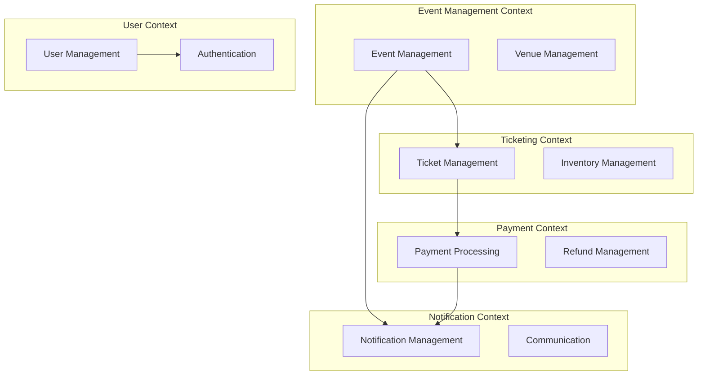
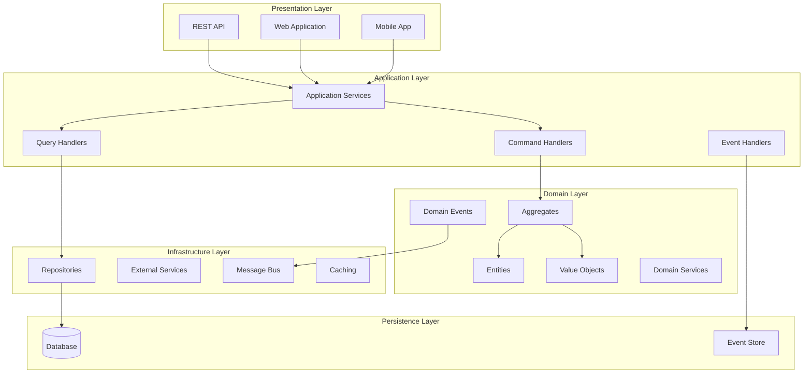
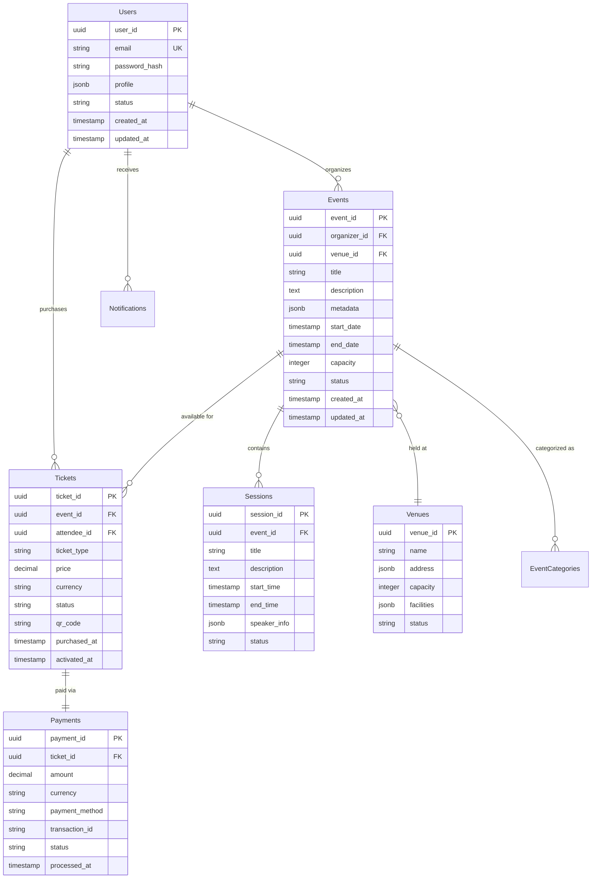
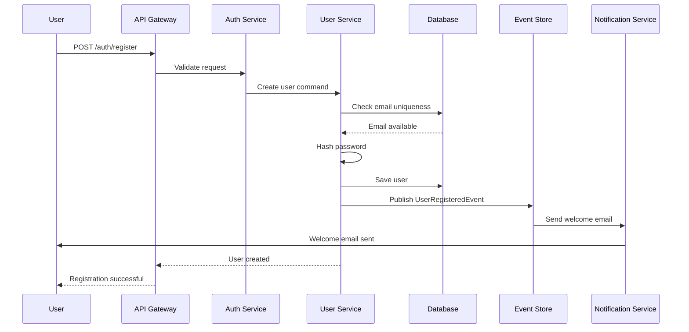
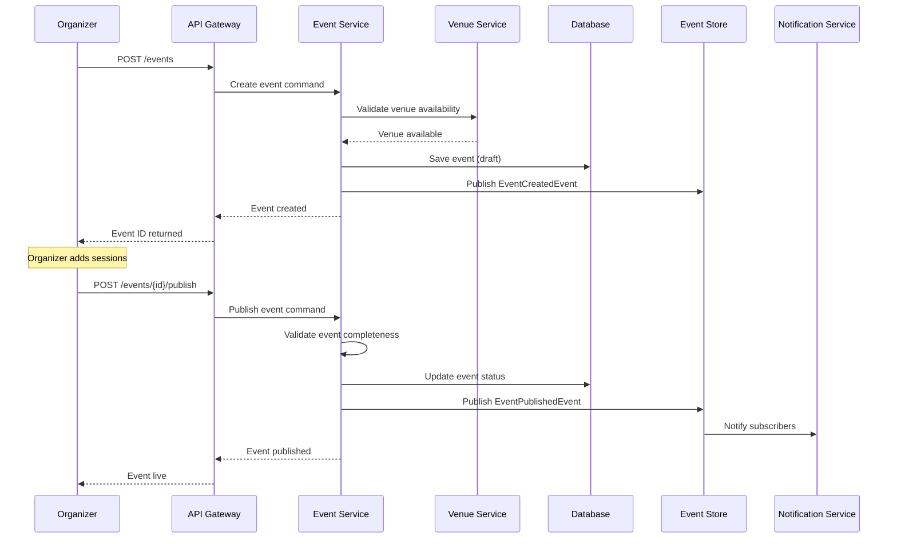
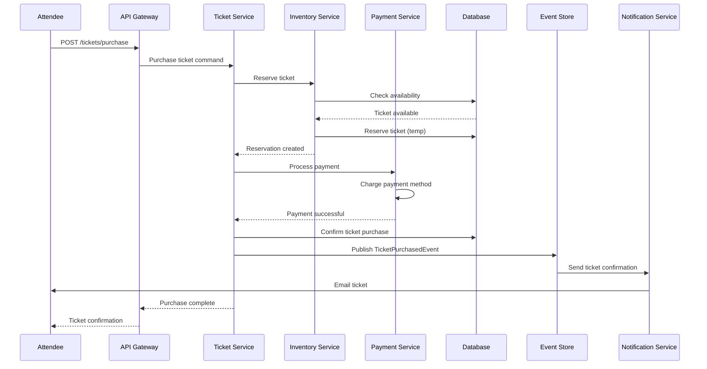
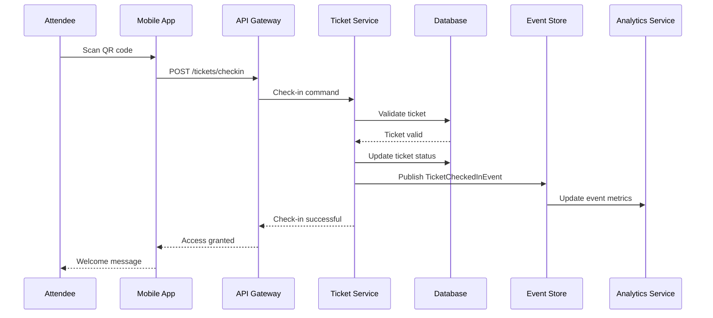
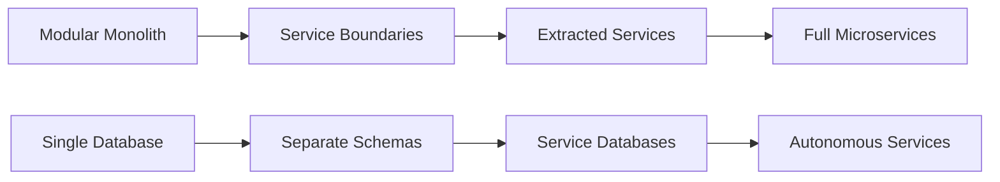

# Event Management System - Architecture Overview

## Table of Contents
1. [Executive Summary](#executive-summary)
2. [Domain-Driven Design (DDD) Overview](#domain-driven-design-ddd-overview)
3. [Bounded Contexts](#bounded-contexts)
4. [Layered Architecture](#layered-architecture)
5. [Domain Model](#domain-model)
6. [Technology Stack](#technology-stack)
7. [Database Design](#database-design)
8. [Major System Flows](#major-system-flows)
9. [Security Architecture](#security-architecture)
10. [Major Modules & Components](#major-modules--components)
11. [Design Decisions & Trade-offs](#design-decisions--trade-offs)
12. [Scalability Considerations](#scalability-considerations)

## Executive Summary

The Event Management System is designed as a production-grade, scalable platform for managing events, ticketing, and attendee experiences. The architecture leverages Domain-Driven Design principles, CQRS pattern, and event-driven architecture to ensure maintainability, scalability, and business alignment.

### Key Features
- Event creation and management
- User registration and authentication
- Ticket sales and inventory management
- Payment processing
- Real-time notifications
- Analytics and reporting

## Domain-Driven Design (DDD) Overview

### Ubiquitous Language
- **Event**: A scheduled occurrence with specific details (date, venue, capacity)
- **Organizer**: Entity responsible for creating and managing events
- **Attendee**: User who registers/purchases tickets for events
- **Ticket**: Admission credential for an event
- **Venue**: Physical or virtual location where events occur
- **Session**: Sub-component of an event (workshops, presentations)

### Strategic Design Patterns
- **Bounded Context**: Clear boundaries between different business domains
- **Context Mapping**: Well-defined relationships between contexts
- **Anti-Corruption Layer**: Protection against external system complexity

## Bounded Contexts



## Layered Architecture

### Architecture Layers



### Layer Responsibilities

#### 1. Presentation Layer
- **REST API**: Exposes HTTP endpoints for external consumption
- **Web Application**: Server-side rendered pages using ASP.NET Core MVC
- **Mobile App Integration**: API contracts for mobile applications

#### 2. Application Layer
- **Application Services**: Orchestrate business operations
- **Command Handlers**: Process commands using MediatR
- **Query Handlers**: Handle read operations (CQRS)
- **Event Handlers**: Process domain events

#### 3. Domain Layer
- **Aggregates**: Consistency boundaries and business rules
- **Entities**: Objects with identity and lifecycle
- **Value Objects**: Immutable objects representing concepts
- **Domain Services**: Business logic that doesn't belong to entities

#### 4. Infrastructure Layer
- **Repositories**: Data access abstraction
- **External Services**: Third-party integrations
- **Message Bus**: Event publishing and subscription

#### 5. Persistence Layer
- **Primary Database**: Transactional data storage
- **Event Store**: Domain event persistence

## Domain Model

### Core Aggregates

#### Event Aggregate
```csharp
public class Event : AggregateRoot<EventId>
{
    public EventTitle Title { get; private set; }
    public EventDescription Description { get; private set; }
    public OrganizerId OrganizerId { get; private set; }
    public VenueId VenueId { get; private set; }
    public EventSchedule Schedule { get; private set; }
    public TicketCapacity Capacity { get; private set; }
    public EventStatus Status { get; private set; }
    private readonly List<Session> _sessions = new();
    
    public IReadOnlyList<Session> Sessions => _sessions.AsReadOnly();
    
    public void ScheduleSession(SessionTitle title, SessionDuration duration, Speaker speaker)
    {
        if (Status != EventStatus.Draft)
            throw new InvalidOperationException("Cannot modify published event");
            
        var session = Session.Create(SessionId.New(), title, duration, speaker);
        _sessions.Add(session);
        
        AddDomainEvent(new SessionScheduledEvent(Id, session.Id));
    }
    
    public void PublishEvent()
    {
        if (_sessions.Count == 0)
            throw new DomainException("Event must have at least one session");
            
        Status = EventStatus.Published;
        AddDomainEvent(new EventPublishedEvent(Id, OrganizerId, Schedule.StartDate));
    }
}
```

#### User Aggregate
```csharp
public class User : AggregateRoot<UserId>
{
    public Email Email { get; private set; }
    public UserProfile Profile { get; private set; }
    public UserStatus Status { get; private set; }
    private readonly List<UserRole> _roles = new();
    
    public IReadOnlyList<UserRole> Roles => _roles.AsReadOnly();
    
    public void AssignRole(UserRole role)
    {
        if (_roles.Contains(role))
            return;
            
        _roles.Add(role);
        AddDomainEvent(new UserRoleAssignedEvent(Id, role));
    }
    
    public bool HasPermission(Permission permission)
    {
        return _roles.Any(role => role.HasPermission(permission));
    }
}
```

#### Ticket Aggregate
```csharp
public class Ticket : AggregateRoot<TicketId>
{
    public EventId EventId { get; private set; }
    public UserId AttendeeId { get; private set; }
    public TicketType Type { get; private set; }
    public Money Price { get; private set; }
    public TicketStatus Status { get; private set; }
    public PurchaseDate PurchasedAt { get; private set; }
    public QrCode QrCode { get; private set; }
    
    public void Activate()
    {
        if (Status != TicketStatus.Purchased)
            throw new InvalidOperationException("Only purchased tickets can be activated");
            
        Status = TicketStatus.Active;
        QrCode = QrCode.Generate();
        
        AddDomainEvent(new TicketActivatedEvent(Id, AttendeeId, EventId));
    }
    
    public void CheckIn(DateTime checkInTime)
    {
        if (Status != TicketStatus.Active)
            throw new InvalidOperationException("Only active tickets can be checked in");
            
        Status = TicketStatus.CheckedIn;
        AddDomainEvent(new TicketCheckedInEvent(Id, AttendeeId, EventId, checkInTime));
    }
}
```

### Value Objects

```csharp
public record EventTitle
{
    public string Value { get; }
    
    public EventTitle(string value)
    {
        if (string.IsNullOrWhiteSpace(value))
            throw new ArgumentException("Event title cannot be empty");
            
        if (value.Length > 200)
            throw new ArgumentException("Event title cannot exceed 200 characters");
            
        Value = value.Trim();
    }
    
    public static implicit operator string(EventTitle title) => title.Value;
    public static implicit operator EventTitle(string value) => new(value);
}

public record Money
{
    public decimal Amount { get; }
    public Currency Currency { get; }
    
    public Money(decimal amount, Currency currency)
    {
        if (amount < 0)
            throw new ArgumentException("Amount cannot be negative");
            
        Amount = amount;
        Currency = currency;
    }
    
    public Money Add(Money other)
    {
        if (Currency != other.Currency)
            throw new InvalidOperationException("Cannot add different currencies");
            
        return new Money(Amount + other.Amount, Currency);
    }
}

public record Email
{
    public string Value { get; }
    
    public Email(string value)
    {
        if (string.IsNullOrWhiteSpace(value))
            throw new ArgumentException("Email cannot be empty");
            
        if (!IsValidEmail(value))
            throw new ArgumentException("Invalid email format");
            
        Value = value.ToLowerInvariant();
    }
    
    private static bool IsValidEmail(string email)
    {
        return System.Text.RegularExpressions.Regex.IsMatch(email, 
            @"^[^@\s]+@[^@\s]+\.[^@\s]+$");
    }
}
```

### Domain Events

```csharp
public record EventPublishedEvent(
    EventId EventId, 
    OrganizerId OrganizerId, 
    DateTime ScheduledDate) : IDomainEvent;

public record TicketPurchasedEvent(
    TicketId TicketId, 
    EventId EventId, 
    UserId AttendeeId, 
    Money Amount) : IDomainEvent;

public record SessionScheduledEvent(
    EventId EventId, 
    SessionId SessionId) : IDomainEvent;

public record UserRegisteredEvent(
    UserId UserId, 
    Email Email, 
    DateTime RegisteredAt) : IDomainEvent;
```

## Technology Stack

### Core Framework
- **.NET 8**: Latest LTS version for optimal performance and features
- **ASP.NET Core 8**: Web framework for APIs and web applications
- **C# 12**: Latest language features and performance improvements

### Application Architecture
- **MediatR**: CQRS and mediator pattern implementation
- **FluentValidation**: Input validation with fluent syntax
- **AutoMapper**: Object-to-object mapping
- **Polly**: Resilience and transient-fault handling

### Data Access
- **Entity Framework Core 8**: ORM for relational data
- **Dapper**: Lightweight ORM for performance-critical queries
- **Redis**: Distributed caching and session storage
- **EventStore**: Event sourcing database

### Messaging & Events
- **Azure Service Bus**: Enterprise messaging platform
- **MassTransit**: Distributed application framework for .NET
- **SignalR**: Real-time web functionality

### Authentication & Security
- **Identity Server 4**: OpenID Connect and OAuth 2.0 framework
- **JWT Bearer**: Token-based authentication
- **Azure Key Vault**: Secrets and certificate management

### Testing
- **xUnit**: Unit testing framework
- **Moq**: Mocking framework
- **FluentAssertions**: Assertion library
- **TestContainers**: Integration testing with containers

### DevOps & Monitoring
- **Azure Application Insights**: Application performance monitoring
- **Serilog**: Structured logging
- **Docker**: Containerization
- **Azure DevOps**: CI/CD pipeline

## Database Design

### Database Selection: PostgreSQL

**Justification:**
- **ACID Compliance**: Full transactional integrity for financial operations
- **JSON Support**: Flexible schema for event metadata and user preferences
- **Performance**: Excellent performance for read-heavy workloads with proper indexing
- **Scalability**: Supports horizontal scaling through read replicas
- **Cost-Effective**: Open-source with strong enterprise support

### Core Entities Schema

| Entity | Description | Key Relationships |
|--------|-------------|-------------------|
| Users | User accounts and profiles | 1:N with Tickets, Events |
| Events | Event details and metadata | N:1 with Organizers, 1:N with Sessions |
| Tickets | Ticket purchases and status | N:1 with Events, N:1 with Users |
| Venues | Event locations | 1:N with Events |
| Sessions | Event sub-components | N:1 with Events |
| Payments | Payment transactions | 1:1 with Tickets |
| Notifications | System notifications | N:1 with Users |

### Database Schema Diagram



### Indexing Strategy

```sql
-- Performance-critical indexes
CREATE INDEX CONCURRENTLY idx_events_organizer_status ON events(organizer_id, status);
CREATE INDEX CONCURRENTLY idx_tickets_event_status ON tickets(event_id, status);
CREATE INDEX CONCURRENTLY idx_tickets_attendee ON tickets(attendee_id);
CREATE INDEX CONCURRENTLY idx_events_date_range ON events(start_date, end_date);
CREATE INDEX CONCURRENTLY idx_sessions_event_time ON sessions(event_id, start_time);

-- Search optimization
CREATE INDEX CONCURRENTLY idx_events_title_gin ON events USING gin(to_tsvector('english', title));
CREATE INDEX CONCURRENTLY idx_events_description_gin ON events USING gin(to_tsvector('english', description));

-- JSON field indexing
CREATE INDEX CONCURRENTLY idx_events_metadata_gin ON events USING gin(metadata);
CREATE INDEX CONCURRENTLY idx_users_profile_gin ON users USING gin(profile);
```

## Major System Flows

### User Registration Flow



### Event Creation Flow



### Ticket Purchase Flow



### Event Check-in Flow



## Security Architecture

### Authentication Strategy

#### Multi-layered Authentication
```csharp
public class JwtAuthenticationService : IAuthenticationService
{
    private readonly IConfiguration _configuration;
    private readonly IUserRepository _userRepository;
    private readonly ILogger<JwtAuthenticationService> _logger;
    
    public async Task<AuthenticationResult> AuthenticateAsync(LoginRequest request)
    {
        // 1. Validate credentials
        var user = await _userRepository.GetByEmailAsync(request.Email);
        if (user == null || !VerifyPassword(request.Password, user.PasswordHash))
        {
            _logger.LogWarning("Failed login attempt for {Email}", request.Email);
            return AuthenticationResult.Failed("Invalid credentials");
        }
        
        // 2. Check account status
        if (user.Status != UserStatus.Active)
        {
            return AuthenticationResult.Failed("Account is not active");
        }
        
        // 3. Generate tokens
        var accessToken = GenerateAccessToken(user);
        var refreshToken = GenerateRefreshToken();
        
        // 4. Store refresh token
        await _userRepository.SaveRefreshTokenAsync(user.Id, refreshToken);
        
        return AuthenticationResult.Success(accessToken, refreshToken);
    }
    
    private string GenerateAccessToken(User user)
    {
        var claims = new[]
        {
            new Claim(ClaimTypes.NameIdentifier, user.Id.ToString()),
            new Claim(ClaimTypes.Email, user.Email),
            new Claim("user_type", user.UserType.ToString()),
            // Add role-based claims
            ...user.Roles.Select(r => new Claim(ClaimTypes.Role, r.Name))
        };
        
        var key = new SymmetricSecurityKey(Encoding.UTF8.GetBytes(_configuration["Jwt:Key"]));
        var credentials = new SigningCredentials(key, SecurityAlgorithms.HmacSha256);
        
        var token = new JwtSecurityToken(
            issuer: _configuration["Jwt:Issuer"],
            audience: _configuration["Jwt:Audience"],
            claims: claims,
            expires: DateTime.UtcNow.AddMinutes(15), // Short-lived access token
            signingCredentials: credentials
        );
        
        return new JwtSecurityTokenHandler().WriteToken(token);
    }
}
```

### Authorization Framework

```csharp
public class PermissionRequirement : IAuthorizationRequirement
{
    public Permission Permission { get; }
    public PermissionRequirement(Permission permission) => Permission = permission;
}

public class PermissionAuthorizationHandler : AuthorizationHandler<PermissionRequirement>
{
    private readonly IUserService _userService;
    
    protected override async Task HandleRequirementAsync(
        AuthorizationHandlerContext context,
        PermissionRequirement requirement)
    {
        var userId = context.User.FindFirst(ClaimTypes.NameIdentifier)?.Value;
        if (userId == null)
        {
            context.Fail();
            return;
        }
        
        var user = await _userService.GetByIdAsync(UserId.From(userId));
        if (user?.HasPermission(requirement.Permission) == true)
        {
            context.Succeed(requirement);
        }
        else
        {
            context.Fail();
        }
    }
}

// Usage in controllers
[Authorize(Policy = "ManageEvents")]
public class EventsController : ControllerBase
{
    [HttpPost]
    public async Task<IActionResult> CreateEvent(CreateEventCommand command)
    {
        // Implementation
    }
}
```

### Input Validation & Sanitization

```csharp
public class CreateEventCommandValidator : AbstractValidator<CreateEventCommand>
{
    public CreateEventCommandValidator()
    {
        RuleFor(x => x.Title)
            .NotEmpty()
            .MaximumLength(200)
            .Must(BeValidTitle)
            .WithMessage("Event title contains invalid characters");
            
        RuleFor(x => x.Description)
            .MaximumLength(5000)
            .Must(BeSafeHtml)
            .WithMessage("Description contains potentially dangerous content");
            
        RuleFor(x => x.StartDate)
            .GreaterThan(DateTime.UtcNow)
            .WithMessage("Event must be scheduled in the future");
            
        RuleFor(x => x.EndDate)
            .GreaterThan(x => x.StartDate)
            .WithMessage("End date must be after start date");
            
        RuleFor(x => x.Capacity)
            .GreaterThan(0)
            .LessThanOrEqualTo(50000)
            .WithMessage("Event capacity must be between 1 and 50,000");
    }
    
    private bool BeValidTitle(string title)
    {
        // Prevent script injection and validate business rules
        return !string.IsNullOrWhiteSpace(title) && 
               !title.Contains("<script") && 
               !title.Contains("javascript:");
    }
    
    private bool BeSafeHtml(string html)
    {
        // Use HTML sanitizer like AntiXSS
        var sanitizer = new HtmlSanitizer();
        var sanitized = sanitizer.Sanitize(html);
        return sanitized == html;
    }
}
```

### Security Configuration

```csharp
public void ConfigureServices(IServiceCollection services)
{
    // HTTPS enforcement
    services.AddHttpsRedirection(options =>
    {
        options.RedirectStatusCode = StatusCodes.Status308PermanentRedirect;
        options.HttpsPort = 443;
    });
    
    // Security headers
    services.AddHsts(options =>
    {
        options.Preload = true;
        options.IncludeSubDomains = true;
        options.MaxAge = TimeSpan.FromDays(365);
    });
    
    // CORS policy
    services.AddCors(options =>
    {
        options.AddPolicy("EventManagementPolicy", builder =>
        {
            builder
                .WithOrigins("https://eventmanagement.com", "https://mobile.eventmanagement.com")
                .AllowedHeaders("Authorization", "Content-Type")
                .AllowedMethods("GET", "POST", "PUT", "DELETE")
                .AllowCredentials();
        });
    });
    
    // Rate limiting
    services.Configure<IpRateLimitOptions>(Configuration.GetSection("IpRateLimiting"));
    services.AddSingleton<IIpPolicyStore, MemoryCacheIpPolicyStore>();
    services.AddSingleton<IRateLimitCounterStore, MemoryCacheRateLimitCounterStore>();
    services.AddSingleton<IRateLimitConfiguration, RateLimitConfiguration>();
}
```

## Major Modules & Components

### 1. Event Management Module

**Responsibilities:**
- Event lifecycle management (creation, publishing, cancellation)
- Session scheduling and speaker management
- Venue coordination and capacity management
- Event metadata and categorization

**Key Components:**
```csharp
public interface IEventService
{
    Task<Result<EventId>> CreateEventAsync(CreateEventCommand command);
    Task<Result> PublishEventAsync(EventId eventId);
    Task<Result> CancelEventAsync(EventId eventId, CancellationReason reason);
    Task<PagedResult<EventSummary>> SearchEventsAsync(EventSearchCriteria criteria);
}

public class EventService : IEventService
{
    private readonly IEventRepository _eventRepository;
    private readonly IVenueService _venueService;
    private readonly IDomainEventDispatcher _eventDispatcher;
    
    public async Task<Result<EventId>> CreateEventAsync(CreateEventCommand command)
    {
        // Validate venue availability
        var venueAvailable = await _venueService.IsAvailableAsync(
            command.VenueId, command.StartDate, command.EndDate);
            
        if (!venueAvailable)
            return Result.Failure<EventId>("Venue not available for selected dates");
            
        // Create event aggregate
        var eventAggregate = Event.Create(
            EventId.New(),
            command.Title,
            command.Description,
            command.OrganizerId,
            command.VenueId,
            new EventSchedule(command.StartDate, command.EndDate),
            new TicketCapacity(command.Capacity));
            
        // Persist and publish events
        await _eventRepository.SaveAsync(eventAggregate);
        await _eventDispatcher.DispatchAsync(eventAggregate.DomainEvents);
        
        return Result.Success(eventAggregate.Id);
    }
}
```

### 2. User Management Module

**Responsibilities:**
- User registration and profile management
- Role and permission management
- Account security and verification
- User preferences and settings

**Design Pattern: Repository + Unit of Work**
```csharp
public class UserService : IUserService
{
    private readonly IUserRepository _userRepository;
    private readonly IEmailService _emailService;
    private readonly IPasswordHasher _passwordHasher;
    private readonly IUnitOfWork _unitOfWork;
    
    public async Task<Result<UserId>> RegisterUserAsync(RegisterUserCommand command)
    {
        using var transaction = await _unitOfWork.BeginTransactionAsync();
        
        try
        {
            // Check email uniqueness
            var existingUser = await _userRepository.GetByEmailAsync(command.Email);
            if (existingUser != null)
                return Result.Failure<UserId>("Email already registered");
                
            // Create user aggregate
            var user = User.Create(
                UserId.New(),
                command.Email,
                _passwordHasher.Hash(command.Password),
                UserProfile.From(command.FirstName, command.LastName));
                
            // Save user
            await _userRepository.SaveAsync(user);
            
            // Send verification email
            await _emailService.SendVerificationEmailAsync(user.Email, user.VerificationToken);
            
            await transaction.CommitAsync();
            return Result.Success(user.Id);
        }
        catch
        {
            await transaction.RollbackAsync();
            throw;
        }
    }
}
```

### 3. Ticketing Module

**Responsibilities:**
- Ticket inventory management
- Purchase workflow and payment integration
- Ticket validation and check-in
- Refund and transfer processing

**CQRS Implementation:**
```csharp
// Command side
public class PurchaseTicketCommandHandler : IRequestHandler<PurchaseTicketCommand, Result<TicketId>>
{
    private readonly ITicketRepository _ticketRepository;
    private readonly IInventoryService _inventoryService;
    private readonly IPaymentService _paymentService;
    
    public async Task<Result<TicketId>> Handle(PurchaseTicketCommand request, CancellationToken cancellationToken)
    {
        // Reserve inventory
        var reservation = await _inventoryService.ReserveTicketAsync(
            request.EventId, request.TicketType, request.Quantity);
            
        if (!reservation.IsSuccessful)
            return Result.Failure<TicketId>("Tickets not available");
            
        try
        {
            // Process payment
            var payment = await _paymentService.ProcessPaymentAsync(
                request.PaymentMethod, reservation.TotalAmount);
                
            if (!payment.IsSuccessful)
            {
                await _inventoryService.ReleaseReservationAsync(reservation.Id);
                return Result.Failure<TicketId>("Payment failed");
            }
            
            // Create ticket
            var ticket = Ticket.Create(
                TicketId.New(),
                request.EventId,
                request.AttendeeId,
                request.TicketType,
                reservation.TotalAmount);
                
            await _ticketRepository.SaveAsync(ticket);
            await _inventoryService.ConfirmReservationAsync(reservation.Id);
            
            return Result.Success(ticket.Id);
        }
        catch
        {
            await _inventoryService.ReleaseReservationAsync(reservation.Id);
            throw;
        }
    }
}

// Query side
public class TicketQueryService : ITicketQueryService
{
    private readonly IReadOnlyRepository<TicketReadModel> _ticketRepository;
    
    public async Task<PagedResult<TicketSummary>> GetUserTicketsAsync(
        UserId userId, 
        TicketFilter filter,
        PagingParameters paging)
    {
        var query = _ticketRepository.Query()
            .Where(t => t.AttendeeId == userId)
            .ApplyFilter(filter)
            .OrderByDescending(t => t.PurchasedAt);
            
        var tickets = await query
            .Skip(paging.Skip)
            .Take(paging.Take)
            .ToListAsync();
            
        var totalCount = await query.CountAsync();
        
        return new PagedResult<TicketSummary>(
            tickets.Select(TicketSummary.From),
            totalCount,
            paging);
    }
}
```

### 4. Payment Module

**Responsibilities:**
- Payment processing integration
- Transaction management and reconciliation
- Refund processing
- Payment method management

**Strategy Pattern for Payment Providers:**
```csharp
public interface IPaymentProvider
{
    string ProviderName { get; }
    Task<PaymentResult> ProcessPaymentAsync(PaymentRequest request);
    Task<RefundResult> ProcessRefundAsync(RefundRequest request);
}

public class StripePaymentProvider : IPaymentProvider
{
    public string ProviderName => "Stripe";
    
    public async Task<PaymentResult> ProcessPaymentAsync(PaymentRequest request)
    {
        var options = new ChargeCreateOptions
        {
            Amount = (long)(request.Amount.Amount * 100), // Convert to cents
            Currency = request.Amount.Currency.Code.ToLower(),
            Source = request.PaymentToken,
            Description = $"Event ticket purchase - {request.Description}",
            Metadata = new Dictionary<string, string>
            {
                ["event_id"] = request.EventId.ToString(),
                ["user_id"] = request.UserId.ToString()
            }
        };
        
        var service = new ChargeService();
        var charge = await service.CreateAsync(options);
        
        return new PaymentResult
        {
            IsSuccessful = charge.Status == "succeeded",
            TransactionId = charge.Id,
            ProcessedAt = DateTime.UtcNow,
            ProviderResponse = charge.ToJson()
        };
    }
}

public class PaymentService : IPaymentService
{
    private readonly Dictionary<string, IPaymentProvider> _providers;
    private readonly IPaymentRepository _paymentRepository;
    
    public async Task<PaymentResult> ProcessPaymentAsync(PaymentRequest request)
    {
        var provider = _providers[request.PreferredProvider];
        
        try
        {
            var result = await provider.ProcessPaymentAsync(request);
            
            // Store payment record
            var payment = Payment.Create(
                PaymentId.New(),
                request.Amount,
                provider.ProviderName,
                result.TransactionId,
                result.IsSuccessful ? PaymentStatus.Completed : PaymentStatus.Failed);
                
            await _paymentRepository.SaveAsync(payment);
            
            return result;
        }
        catch (Exception ex)
        {
            // Log error and create failed payment record
            var failedPayment = Payment.CreateFailed(
                PaymentId.New(),
                request.Amount,
                provider.ProviderName,
                ex.Message);
                
            await _paymentRepository.SaveAsync(failedPayment);
            throw;
        }
    }
}
```

### 5. Notification Module

**Responsibilities:**
- Multi-channel notification delivery (email, SMS, push)
- Template management and personalization
- Delivery tracking and retry logic
- User preference management

**Observer Pattern with Event Handlers:**
```csharp
public class EventPublishedNotificationHandler : INotificationHandler<EventPublishedEvent>
{
    private readonly INotificationService _notificationService;
    private readonly IUserRepository _userRepository;
    
    public async Task Handle(EventPublishedEvent notification, CancellationToken cancellationToken)
    {
        // Get interested users (followers of organizer, category subscribers)
        var interestedUsers = await _userRepository.GetInterestedUsersAsync(
            notification.OrganizerId);
            
        var tasks = interestedUsers.Select(async user =>
        {
            var notificationRequest = new NotificationRequest
            {
                UserId = user.Id,
                Template = NotificationTemplate.EventPublished,
                Channel = user.PreferredNotificationChannel,
                Data = new
                {
                    EventTitle = notification.EventTitle,
                    OrganizerName = notification.OrganizerName,
                    EventUrl = $"https://eventmanagement.com/events/{notification.EventId}"
                }
            };
            
            await _notificationService.SendNotificationAsync(notificationRequest);
        });
        
        await Task.WhenAll(tasks);
    }
}

public class NotificationService : INotificationService
{
    private readonly Dictionary<NotificationChannel, INotificationChannel> _channels;
    private readonly INotificationRepository _notificationRepository;
    
    public async Task SendNotificationAsync(NotificationRequest request)
    {
        var channel = _channels[request.Channel];
        
        try
        {
            var result = await channel.SendAsync(request);
            
            var notification = Notification.Create(
                NotificationId.New(),
                request.UserId,
                request.Template,
                request.Channel,
                result.IsSuccessful ? NotificationStatus.Delivered : NotificationStatus.Failed);
                
            await _notificationRepository.SaveAsync(notification);
        }
        catch (Exception ex)
        {
            // Log error and schedule retry
            await ScheduleRetryAsync(request, ex);
        }
    }
}
```

## Design Decisions & Trade-offs

### 1. CQRS vs Traditional CRUD

**Decision:** Implement CQRS for the core business operations

**Justification:**
- **Read/Write Separation**: Different optimization strategies for queries vs commands
- **Scalability**: Independent scaling of read and write sides
- **Performance**: Optimized read models for complex queries
- **Flexibility**: Different data models for different use cases

**Trade-offs:**
- ✅ **Pros**: Better performance, clearer separation of concerns, optimized for different workloads
- ❌ **Cons**: Increased complexity, eventual consistency challenges, more code to maintain

### 2. Event Sourcing vs Traditional State Storage

**Decision:** Use Event Sourcing for critical aggregates (Events, Tickets, Payments)

**Justification:**
- **Audit Trail**: Complete history of all business-critical operations
- **Temporal Queries**: Ability to query past states
- **Event-Driven Architecture**: Natural fit for publishing domain events
- **Compliance**: Required for financial transactions and audit purposes

**Trade-offs:**
- ✅ **Pros**: Complete audit trail, replay capabilities, natural event publishing
- ❌ **Cons**: Complex queries, snapshot requirements, storage overhead

### 3. Microservices vs Modular Monolith

**Decision:** Start with Modular Monolith, plan for Microservices evolution

**Justification:**
- **Team Size**: Current team size doesn't justify microservices complexity
- **Domain Maturity**: Business rules still evolving, bounded contexts not fully stable
- **Deployment Simplicity**: Single deployment unit reduces operational overhead
- **Performance**: No network latency between modules

**Evolution Path:**


### 4. Database Choice: PostgreSQL vs NoSQL

**Decision:** PostgreSQL as primary database with Redis for caching

**Justification:**
- **ACID Properties**: Essential for financial transactions
- **JSON Support**: Flexibility for event metadata without sacrificing consistency
- **Query Complexity**: Support for complex analytical queries
- **Ecosystem**: Mature tooling and operational knowledge

**Hybrid Approach:**
- **PostgreSQL**: Transactional data, complex queries, reporting
- **Redis**: Session storage, caching, real-time features
- **Event Store**: Domain event persistence and replay

### 5. Authentication: JWT vs Session-based

**Decision:** JWT with short expiration + Refresh tokens

**Justification:**
- **Stateless**: No server-side session storage required
- **Scalability**: Easy to scale across multiple instances
- **Mobile Support**: Better fit for mobile applications
- **Microservices Ready**: Works well in distributed environments

**Security Measures:**
```csharp
public class TokenConfiguration
{
    public const int AccessTokenExpirationMinutes = 15;
    public const int RefreshTokenExpirationDays = 30;
    public const int MaxRefreshTokensPerUser = 5;
    
    // Token rotation on refresh
    public static TokenPair RefreshTokens(string refreshToken, User user)
    {
        // Invalidate old refresh token and generate new pair
        return new TokenPair(
            GenerateAccessToken(user),
            GenerateRefreshToken(user.Id));
    }
}
```

### 6. Error Handling Strategy

**Decision:** Result Pattern + Global Exception Handling

**Implementation:**
```csharp
public class Result<T>
{
    public bool IsSuccess { get; }
    public T Value { get; }
    public string Error { get; }
    public List<string> Errors { get; }
    
    public static Result<T> Success(T value) => new(true, value, null, null);
    public static Result<T> Failure(string error) => new(false, default, error, null);
    public static Result<T> Failure(List<string> errors) => new(false, default, null, errors);
}

// Global exception handling
public class GlobalExceptionMiddleware
{
    public async Task InvokeAsync(HttpContext context, RequestDelegate next)
    {
        try
        {
            await next(context);
        }
        catch (DomainException ex)
        {
            await HandleDomainExceptionAsync(context, ex);
        }
        catch (ValidationException ex)
        {
            await HandleValidationExceptionAsync(context, ex);
        }
        catch (Exception ex)
        {
            await HandleGenericExceptionAsync(context, ex);
        }
    }
}
```

## Scalability Considerations

### 1. Database Scaling Strategy

**Read Replicas:**
```yaml
# Docker Compose example
services:
  postgres-primary:
    image: postgres:15
    environment:
      POSTGRES_REPLICATION_MODE: master
      POSTGRES_REPLICATION_USER: replicator
      
  postgres-replica:
    image: postgres:15
    environment:
      POSTGRES_REPLICATION_MODE: slave
      POSTGRES_MASTER_HOST: postgres-primary
```

**Connection String Strategy:**
```csharp
public class DatabaseConnectionFactory
{
    private readonly string _writeConnectionString;
    private readonly List<string> _readConnectionStrings;
    
    public string GetWriteConnection() => _writeConnectionString;
    
    public string GetReadConnection()
    {
        // Round-robin or weighted selection
        var index = Random.Next(_readConnectionStrings.Count);
        return _readConnectionStrings[index];
    }
}
```

### 2. Caching Strategy

**Multi-Level Caching:**
```csharp
public class CachingEventService : IEventService
{
    private readonly IEventService _eventService;
    private readonly IMemoryCache _l1Cache;
    private readonly IDistributedCache _l2Cache;
    
    public async Task<EventDetails> GetEventAsync(EventId eventId)
    {
        // L1 Cache (Memory)
        if (_l1Cache.TryGetValue($"event:{eventId}", out EventDetails cached))
            return cached;
            
        // L2 Cache (Redis)
        var serialized = await _l2Cache.GetStringAsync($"event:{eventId}");
        if (serialized != null)
        {
            var deserialized = JsonSerializer.Deserialize<EventDetails>(serialized);
            _l1Cache.Set($"event:{eventId}", deserialized, TimeSpan.FromMinutes(5));
            return deserialized;
        }
        
        // Database
        var eventDetails = await _eventService.GetEventAsync(eventId);
        
        // Cache for future requests
        await _l2Cache.SetStringAsync(
            $"event:{eventId}", 
            JsonSerializer.Serialize(eventDetails),
            new DistributedCacheEntryOptions
            {
                AbsoluteExpirationRelativeToNow = TimeSpan.FromHours(1)
            });
            
        _l1Cache.Set($"event:{eventId}", eventDetails, TimeSpan.FromMinutes(5));
        
        return eventDetails;
    }
}
```

### 3. Asynchronous Processing

**Background Job Processing:**
```csharp
public class EmailNotificationJob : IBackgroundJob
{
    private readonly IEmailService _emailService;
    private readonly INotificationRepository _notificationRepository;
    
    [AutomaticRetry(Attempts = 3)]
    public async Task SendEmailNotificationAsync(EmailNotificationRequest request)
    {
        try
        {
            await _emailService.SendEmailAsync(request);
            
            await _notificationRepository.UpdateStatusAsync(
                request.NotificationId, 
                NotificationStatus.Delivered);
        }
        catch (Exception ex)
        {
            await _notificationRepository.UpdateStatusAsync(
                request.NotificationId, 
                NotificationStatus.Failed,
                ex.Message);
                
            throw; // Trigger retry
        }
    }
}

// Background service registration
services.AddHangfire(config =>
{
    config.UsePostgreSqlStorage(connectionString);
    config.UseRetryAttribute(retries: 3);
});
```

### 4. API Rate Limiting

```csharp
public class RateLimitingConfiguration
{
    public static void Configure(IServiceCollection services)
    {
        services.Configure<IpRateLimitOptions>(options =>
        {
            options.GeneralRules = new List<RateLimitRule>
            {
                new RateLimitRule
                {
                    Endpoint = "POST:/api/tickets/purchase",
                    Period = "1m",
                    Limit = 5 // Max 5 ticket purchases per minute per IP
                },
                new RateLimitRule
                {
                    Endpoint = "*",
                    Period = "1m",
                    Limit = 100 // General rate limit
                }
            };
        });
    }
}
```

### 5. Performance Monitoring

```csharp
public class PerformanceMiddleware
{
    private readonly RequestDelegate _next;
    private readonly ILogger<PerformanceMiddleware> _logger;
    
    public async Task InvokeAsync(HttpContext context)
    {
        var stopwatch = Stopwatch.StartNew();
        
        using var activity = Activity.StartActivity("HttpRequest");
        activity?.SetTag("http.method", context.Request.Method);
        activity?.SetTag("http.url", context.Request.Path);
        
        try
        {
            await _next(context);
        }
        finally
        {
            stopwatch.Stop();
            
            if (stopwatch.ElapsedMilliseconds > 1000) // Log slow requests
            {
                _logger.LogWarning(
                    "Slow request: {Method} {Path} took {ElapsedMs}ms",
                    context.Request.Method,
                    context.Request.Path,
                    stopwatch.ElapsedMilliseconds);
            }
            
            activity?.SetTag("http.status_code", context.Response.StatusCode);
            activity?.SetTag("duration_ms", stopwatch.ElapsedMilliseconds);
        }
    }
}
```

---

## Conclusion

This Event Management System architecture provides a solid foundation for a scalable, maintainable, and business-aligned solution. The design emphasizes:

1. **Domain-Driven Design**: Clear business logic separation and domain model integrity
2. **Event-Driven Architecture**: Loose coupling and scalability through domain events
3. **CQRS Pattern**: Optimized read and write operations
4. **Security-First**: Comprehensive security measures throughout all layers
5. **Scalability**: Built-in patterns for horizontal and vertical scaling
6. **Maintainability**: Clean architecture with clear boundaries and responsibilities

The modular monolith approach allows for rapid development while maintaining the flexibility to evolve into microservices as the system grows. The technology stack provides modern, production-ready tools that support the architecture's goals while maintaining developer productivity.

Key success factors for implementation:
- Start with core domain model and expand incrementally
- Implement comprehensive testing strategy from day one
- Monitor performance and optimize based on real usage patterns
- Maintain clear documentation and team knowledge sharing
- Plan for data migration and backward compatibility

This architecture serves as a blueprint for building a robust event management platform that can handle enterprise-scale requirements while remaining adaptable to changing business needs.