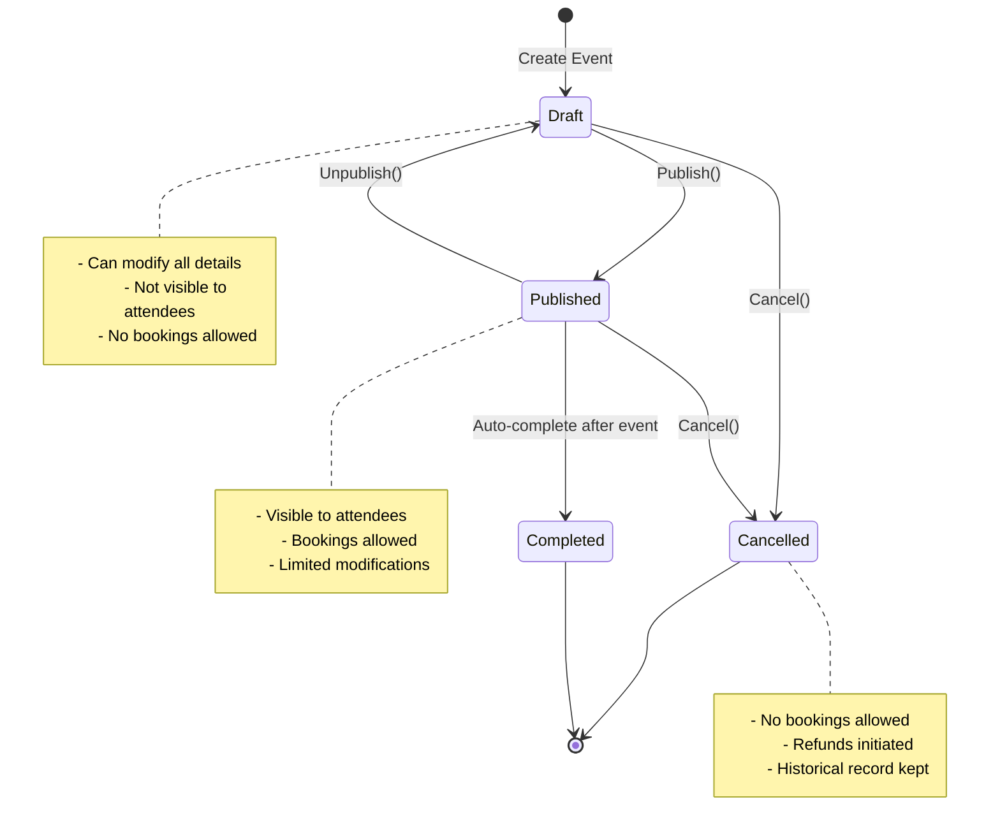
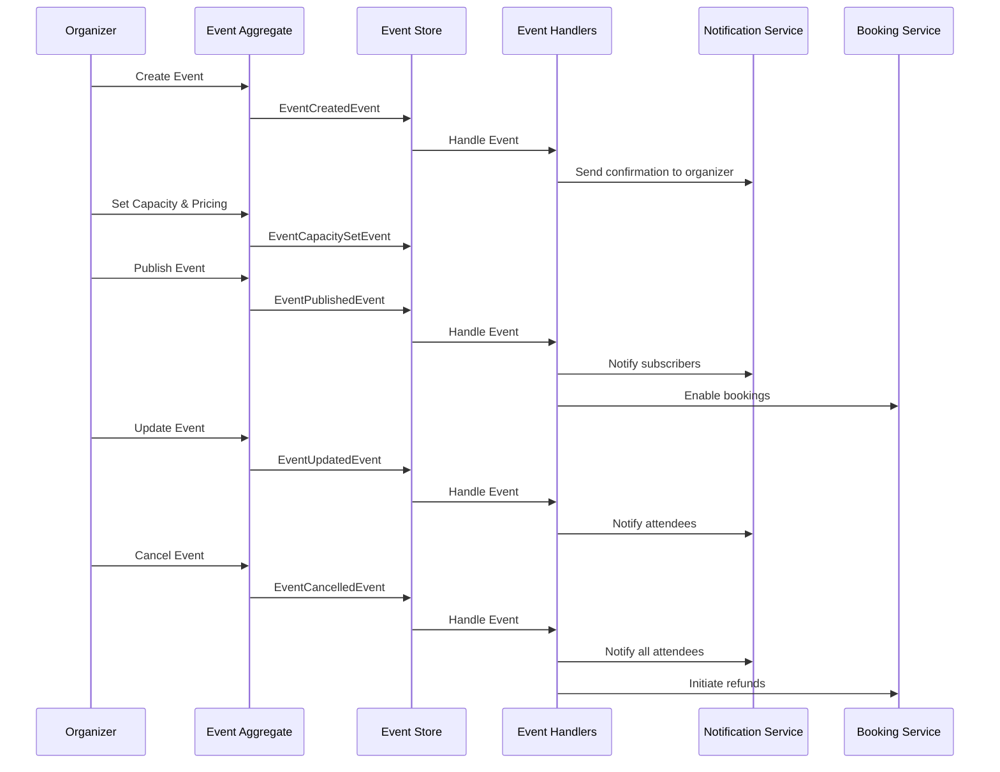

# Epic 1: Event Management - Detailed Implementation Guide

## Table of Contents
1. [Epic Overview](#epic-overview)
2. [Domain Analysis](#domain-analysis)
3. [User Stories with Technical Details](#user-stories-with-technical-details)
4. [Domain Model Design](#domain-model-design)
5. [Technical Architecture](#technical-architecture)
6. [Implementation Roadmap](#implementation-roadmap)
7. [Testing Strategy](#testing-strategy)

## Epic Overview

**Epic 1: Event Management**
```
As an event organizer
I want to create and manage events
So that I can reach my target audience and successfully execute events
```

### Business Value
- **Primary Users**: Event Organizers, Event Administrators
- **Business Goals**: Enable efficient event lifecycle management from creation to completion
- **Success Metrics**: Event creation success rate, time-to-publish, organizer satisfaction

### Domain Complexity Assessment
**High Complexity** - This context requires full DDD implementation due to:
- Complex event lifecycle with multiple states
- Capacity management with business rules
- Pricing strategies and business logic
- Integration with multiple bounded contexts (booking, notifications)

## Domain Analysis

### Bounded Context: Event Management

#### Core Responsibilities
- Event lifecycle management (creation → publishing → execution → completion)
- Capacity and inventory control
- Pricing strategy implementation
- Event metadata and categorization
- Venue coordination
- Event visibility and access control

#### Ubiquitous Language
- **Event**: A scheduled occurrence with specific details (date, venue, capacity)
- **Organizer**: Entity responsible for creating and managing events
- **Session**: Sub-component of an event (workshops, presentations, tracks)
- **Capacity**: Maximum number of attendees for an event or session
- **Visibility**: Access level (public/private/invite-only)
- **Event State**: Current status in the event lifecycle
- **Pricing Tier**: Different price levels for the same event

## User Stories with Technical Details

### US001: Create New Event with Basic Details

#### User Story
```
As an event organizer
I want to create a new event with basic details (title, description, date, venue)
So that I can start planning my event
```

#### Acceptance Criteria
```gherkin
Given I am an authenticated organizer
When I create an event with valid basic details
Then the event should be saved in draft status
And I should receive an event ID for future operations
And the system should validate all required fields
And the event should be assigned to me as the organizer

Scenario: Valid event creation
Given I provide title "Tech Conference 2025"
And description "Annual technology conference"
And start date "2025-12-15T09:00:00Z"
And end date "2025-12-15T17:00:00Z"
And venue ID "venue-123"
When I submit the create event request
Then the event should be created with status "Draft"
And I should receive event ID
And the created event should have CreatedAt timestamp

Scenario: Invalid data validation
Given I provide an empty title
When I submit the create event request
Then I should receive validation error "Title is required"
And no event should be created
```

#### Technical Specifications

**Domain Model**
```csharp
public class Event : AggregateRoot<EventId>
{
    public EventTitle Title { get; private set; }
    public EventDescription Description { get; private set; }
    public OrganizerId OrganizerId { get; private set; }
    public VenueId VenueId { get; private set; }
    public EventSchedule Schedule { get; private set; }
    public EventStatus Status { get; private set; }
    public EventVisibility Visibility { get; private set; }
    public DateTime CreatedAt { get; private set; }
    public DateTime? UpdatedAt { get; private set; }

    public static Event Create(
        EventTitle title,
        EventDescription description,
        OrganizerId organizerId,
        VenueId venueId,
        EventSchedule schedule)
    {
        var eventId = EventId.New();
        var @event = new Event
        {
            Id = eventId,
            Title = title,
            Description = description,
            OrganizerId = organizerId,
            VenueId = venueId,
            Schedule = schedule,
            Status = EventStatus.Draft,
            Visibility = EventVisibility.Private,
            CreatedAt = DateTime.UtcNow
        };

        @event.AddDomainEvent(new EventCreatedEvent(
            eventId,
            organizerId,
            title,
            schedule.StartDate));

        return @event;
    }
}
```

**Command & Handler**
```csharp
public record CreateEventCommand(
    string Title,
    string Description,
    Guid OrganizerId,
    Guid VenueId,
    DateTime StartDate,
    DateTime EndDate) : ICommand<EventId>;

public class CreateEventCommandHandler : CommandHandler, IRequestHandler<CreateEventCommand, Result<EventId>>
{
    private readonly IEventRepository _eventRepository;
    private readonly IVenueRepository _venueRepository;

    public async Task<Result<EventId>> Handle(CreateEventCommand command, CancellationToken cancellationToken)
    {
        // Validate venue exists
        var venue = await _venueRepository.GetByIdAsync(new VenueId(command.VenueId));
        if (venue == null)
            return Result<EventId>.Failure("Venue not found");

        // Create event
        var @event = Event.Create(
            new EventTitle(command.Title),
            new EventDescription(command.Description),
            new OrganizerId(command.OrganizerId),
            new VenueId(command.VenueId),
            new EventSchedule(command.StartDate, command.EndDate));

        await _eventRepository.AddAsync(@event);
        await _eventRepository.UnitOfWork.SaveChangesAsync(cancellationToken);

        return Result<EventId>.Success(@event.Id);
    }
}
```

**API Endpoint**
```csharp
[ApiController]
[Route("api/v1/[controller]")]
[Authorize(Policy = "OrganizerPolicy")]
public class EventsController : ApiController
{
    [HttpPost]
    public async Task<IActionResult> CreateEvent([FromBody] CreateEventRequest request)
    {
        var command = new CreateEventCommand(
            request.Title,
            request.Description,
            GetCurrentUserId(),
            request.VenueId,
            request.StartDate,
            request.EndDate);

        var result = await Mediator.Send(command);
        
        return result.IsSuccess 
            ? CreatedAtAction(nameof(GetEvent), new { id = result.Value }, result.Value)
            : BadRequest(result.Errors);
    }
}
```

---

### US002: Set Event Capacity and Pricing Tiers

#### User Story
```
As an event organizer
I want to set event capacity and multiple pricing tiers
So that I can control attendance and implement pricing strategies
```

#### Acceptance Criteria
```gherkin
Given I have a draft event
When I set capacity and pricing tiers
Then the event should have capacity constraints
And multiple pricing tiers should be available
And each tier should have its own capacity allocation

Scenario: Set basic capacity and pricing
Given I have event "event-123" in draft status
When I set total capacity to 500
And I add pricing tier "Early Bird" with price $50 and capacity 100
And I add pricing tier "Regular" with price $75 and capacity 300
And I add pricing tier "VIP" with price $150 and capacity 100
Then the event should have total capacity 500
And pricing tiers should sum to total capacity
And each tier should be bookable independently
```

#### Technical Specifications

**Enhanced Domain Model**
```csharp
public class Event : AggregateRoot<EventId>
{
    // ... existing properties
    public EventCapacity Capacity { get; private set; }
    private readonly List<PricingTier> _pricingTiers = new();
    public IReadOnlyList<PricingTier> PricingTiers => _pricingTiers.AsReadOnly();

    public void SetCapacityAndPricing(
        int totalCapacity, 
        IEnumerable<PricingTierDefinition> pricingTiers)
    {
        if (Status != EventStatus.Draft)
            throw new DomainException("Cannot modify capacity after event is published");

        var tiersList = pricingTiers.ToList();
        var totalTierCapacity = tiersList.Sum(t => t.Capacity);
        
        if (totalTierCapacity != totalCapacity)
            throw new DomainException("Pricing tier capacities must sum to total capacity");

        Capacity = new EventCapacity(totalCapacity);
        _pricingTiers.Clear();
        
        foreach (var tierDef in tiersList)
        {
            _pricingTiers.Add(new PricingTier(
                PricingTierId.New(),
                tierDef.Name,
                tierDef.Price,
                tierDef.Capacity,
                tierDef.SaleStartDate,
                tierDef.SaleEndDate));
        }

        AddDomainEvent(new EventCapacitySetEvent(Id, totalCapacity, tiersList.Count));
        UpdatedAt = DateTime.UtcNow;
    }
}

public class PricingTier : Entity<PricingTierId>
{
    public TierName Name { get; private set; }
    public Money Price { get; private set; }
    public TierCapacity Capacity { get; private set; }
    public TierCapacity AvailableCapacity { get; private set; }
    public DateTime SaleStartDate { get; private set; }
    public DateTime SaleEndDate { get; private set; }
    public bool IsActive => DateTime.UtcNow >= SaleStartDate && DateTime.UtcNow <= SaleEndDate;

    public bool CanBookTickets(int quantity)
    {
        return IsActive && AvailableCapacity.Value >= quantity;
    }

    public void ReserveCapacity(int quantity)
    {
        if (!CanBookTickets(quantity))
            throw new DomainException($"Cannot reserve {quantity} tickets for tier {Name}");
        
        AvailableCapacity = new TierCapacity(AvailableCapacity.Value - quantity);
    }
}
```

**Command & Handler**
```csharp
public record SetEventCapacityCommand(
    Guid EventId,
    int TotalCapacity,
    List<PricingTierDefinition> PricingTiers) : ICommand;

public record PricingTierDefinition(
    string Name,
    decimal Price,
    string Currency,
    int Capacity,
    DateTime SaleStartDate,
    DateTime SaleEndDate);

public class SetEventCapacityCommandHandler : CommandHandler, IRequestHandler<SetEventCapacityCommand, Result>
{
    private readonly IEventRepository _eventRepository;

    public async Task<Result> Handle(SetEventCapacityCommand command, CancellationToken cancellationToken)
    {
        var @event = await _eventRepository.GetByIdAsync(new EventId(command.EventId));
        if (@event == null)
            return Result.Failure("Event not found");

        @event.SetCapacityAndPricing(command.TotalCapacity, command.PricingTiers);
        
        await _eventRepository.UnitOfWork.SaveChangesAsync(cancellationToken);
        return Result.Success();
    }
}
```

---

### US003: Publish/Unpublish Events

#### User Story
```
As an event organizer
I want to publish and unpublish events
So that I can control when events become visible to attendees
```

#### Acceptance Criteria
```gherkin
Given I have a complete draft event
When I publish the event
Then the event should become visible to potential attendees
And the event status should change to "Published"
And notification should be sent to subscribers

Scenario: Publish complete event
Given I have event with title, description, venue, capacity, and pricing
And event status is "Draft"
When I publish the event
Then event status should be "Published"
And event should appear in public listings
And EventPublishedEvent should be raised

Scenario: Cannot publish incomplete event
Given I have event without pricing tiers
When I try to publish the event
Then I should receive error "Event must have pricing tiers to be published"
And event status should remain "Draft"
```

#### Technical Specifications

**Domain Model Updates**
```csharp
public enum EventStatus
{
    Draft,
    Published,
    Cancelled,
    Completed
}

public class Event : AggregateRoot<EventId>
{
    // ... existing properties

    public void Publish()
    {
        if (Status != EventStatus.Draft)
            throw new DomainException("Only draft events can be published");

        ValidateEventCompleteness();

        Status = EventStatus.Published;
        Visibility = EventVisibility.Public;
        UpdatedAt = DateTime.UtcNow;

        AddDomainEvent(new EventPublishedEvent(
            Id,
            OrganizerId,
            Title,
            Schedule.StartDate,
            Capacity.TotalCapacity));
    }

    public void Unpublish(string reason)
    {
        if (Status != EventStatus.Published)
            throw new DomainException("Only published events can be unpublished");

        Status = EventStatus.Draft;
        Visibility = EventVisibility.Private;
        UpdatedAt = DateTime.UtcNow;

        AddDomainEvent(new EventUnpublishedEvent(Id, OrganizerId, reason));
    }

    private void ValidateEventCompleteness()
    {
        var errors = new List<string>();

        if (string.IsNullOrEmpty(Title?.Value))
            errors.Add("Event must have a title");

        if (VenueId == null)
            errors.Add("Event must have a venue");

        if (Capacity == null || Capacity.TotalCapacity <= 0)
            errors.Add("Event must have valid capacity");

        if (!_pricingTiers.Any())
            errors.Add("Event must have pricing tiers");

        if (Schedule == null || Schedule.StartDate <= DateTime.UtcNow)
            errors.Add("Event must have future start date");

        if (errors.Any())
            throw new DomainException($"Cannot publish incomplete event: {string.Join(", ", errors)}");
    }
}
```

**Event Handler for Notifications**
```csharp
public class EventPublishedEventHandler : INotificationHandler<EventPublishedEvent>
{
    private readonly INotificationService _notificationService;
    private readonly IEventSubscriptionRepository _subscriptionRepository;

    public async Task Handle(EventPublishedEvent notification, CancellationToken cancellationToken)
    {
        // Notify subscribers
        var subscribers = await _subscriptionRepository.GetSubscribersForOrganizerAsync(
            notification.OrganizerId);

        foreach (var subscriber in subscribers)
        {
            await _notificationService.SendEventPublishedNotificationAsync(
                subscriber.UserId,
                notification.EventId,
                notification.EventTitle);
        }

        // Update search index
        await _notificationService.PublishToSearchIndexAsync(new EventIndexUpdate
        {
            EventId = notification.EventId,
            Action = IndexAction.Add
        });
    }
}
```

---

### US004: Update Event Details

#### User Story
```
As an event organizer
I want to update event details before and after publishing
So that I can keep event information current and accurate
```

#### Acceptance Criteria
```gherkin
Given I am the organizer of an event
When I update event details
Then the changes should be saved
And notifications should be sent if event is published
And attendees should be informed of significant changes

Scenario: Update draft event
Given I have a draft event
When I update any event details
Then changes should be saved immediately
And no notifications should be sent

Scenario: Update published event
Given I have a published event with bookings
When I update non-critical details (description)
Then changes should be saved
And update notification should be sent to attendees

Scenario: Restrict critical updates
Given I have a published event with bookings
When I try to change the event date
Then I should receive a warning about existing bookings
And confirmation should be required
```

#### Technical Specifications

**Domain Model**
```csharp
public class Event : AggregateRoot<EventId>
{
    public void UpdateDetails(
        EventTitle title,
        EventDescription description,
        EventSchedule newSchedule,
        bool forceUpdate = false)
    {
        var changes = new List<EventChange>();

        // Track changes
        if (!Title.Equals(title))
        {
            changes.Add(new EventChange("Title", Title?.Value, title?.Value));
            Title = title;
        }

        if (!Description.Equals(description))
        {
            changes.Add(new EventChange("Description", Description?.Value, description?.Value));
            Description = description;
        }

        // Critical changes need validation
        if (!Schedule.Equals(newSchedule))
        {
            if (Status == EventStatus.Published && HasBookings() && !forceUpdate)
            {
                throw new DomainException(
                    "Cannot change event schedule with existing bookings without force confirmation");
            }

            changes.Add(new EventChange("Schedule", 
                $"{Schedule.StartDate} - {Schedule.EndDate}",
                $"{newSchedule.StartDate} - {newSchedule.EndDate}"));
            Schedule = newSchedule;
        }

        if (changes.Any())
        {
            UpdatedAt = DateTime.UtcNow;
            
            if (Status == EventStatus.Published)
            {
                AddDomainEvent(new EventUpdatedEvent(Id, OrganizerId, changes));
            }
        }
    }

    private bool HasBookings()
    {
        // This would typically be checked via a domain service
        // For now, assume we have a method to check
        return _pricingTiers.Any(t => t.AvailableCapacity.Value < t.Capacity.Value);
    }
}

public record EventChange(string Field, string OldValue, string NewValue);
```

---

### US005: Cancel Events with Proper Notifications

#### User Story
```
As an event organizer
I want to cancel events with proper notifications
So that I can handle unforeseen circumstances professionally
```

#### Acceptance Criteria
```gherkin
Given I am the organizer of an event
When I cancel the event with a reason
Then the event status should change to "Cancelled"
And all attendees should be notified
And refund process should be initiated for paid tickets

Scenario: Cancel event with bookings
Given I have a published event with 50 bookings
When I cancel the event with reason "Venue unavailable"
Then event status should be "Cancelled"
And 50 cancellation notifications should be sent
And 50 refund processes should be initiated
```

#### Technical Specifications

**Domain Model**
```csharp
public class Event : AggregateRoot<EventId>
{
    public CancellationReason CancellationReason { get; private set; }
    public DateTime? CancelledAt { get; private set; }

    public void Cancel(string reason, bool initiateRefunds = true)
    {
        if (Status == EventStatus.Cancelled)
            throw new DomainException("Event is already cancelled");

        if (Status == EventStatus.Completed)
            throw new DomainException("Cannot cancel completed event");

        var previousStatus = Status;
        Status = EventStatus.Cancelled;
        CancellationReason = new CancellationReason(reason);
        CancelledAt = DateTime.UtcNow;
        UpdatedAt = DateTime.UtcNow;

        AddDomainEvent(new EventCancelledEvent(
            Id,
            OrganizerId,
            reason,
            previousStatus,
            initiateRefunds));
    }
}

public class EventCancelledEventHandler : INotificationHandler<EventCancelledEvent>
{
    private readonly IBookingRepository _bookingRepository;
    private readonly INotificationService _notificationService;
    private readonly IRefundService _refundService;

    public async Task Handle(EventCancelledEvent notification, CancellationToken cancellationToken)
    {
        // Get all bookings for the event
        var bookings = await _bookingRepository.GetByEventIdAsync(notification.EventId);

        foreach (var booking in bookings)
        {
            // Send cancellation notification
            await _notificationService.SendEventCancellationNotificationAsync(
                booking.AttendeeId,
                notification.EventId,
                notification.Reason);

            // Initiate refund if requested
            if (notification.InitiateRefunds && booking.IsPaid)
            {
                await _refundService.InitiateRefundAsync(booking.PaymentId);
            }
        }
    }
}
```

---

### US006: Set Event Visibility

#### User Story
```
As an event organizer
I want to set event visibility (public/private/invite-only)
So that I can control who can see and access my events
```

#### Acceptance Criteria
```gherkin
Given I am creating or updating an event
When I set the event visibility
Then the event should only be accessible based on visibility rules
And appropriate access controls should be enforced

Scenario: Public event
Given I set event visibility to "Public"
When anyone searches for events
Then this event should appear in results

Scenario: Private event
Given I set event visibility to "Private"
When non-organizers search for events
Then this event should not appear in results

Scenario: Invite-only event
Given I set event visibility to "InviteOnly"
When I invite specific users
Then only invited users should see the event
```

#### Technical Specifications

**Domain Model**
```csharp
public enum EventVisibility
{
    Private,    // Only organizer can see
    Public,     // Everyone can see
    InviteOnly  // Only invited users can see
}

public class Event : AggregateRoot<EventId>
{
    public EventVisibility Visibility { get; private set; }
    private readonly List<InvitedUser> _invitedUsers = new();
    public IReadOnlyList<InvitedUser> InvitedUsers => _invitedUsers.AsReadOnly();

    public void SetVisibility(EventVisibility visibility)
    {
        if (Visibility != visibility)
        {
            Visibility = visibility;
            UpdatedAt = DateTime.UtcNow;

            AddDomainEvent(new EventVisibilityChangedEvent(Id, visibility));
        }
    }

    public void InviteUser(UserId userId, InvitationRole role = InvitationRole.Attendee)
    {
        if (Visibility != EventVisibility.InviteOnly)
            throw new DomainException("Can only invite users to invite-only events");

        if (_invitedUsers.Any(u => u.UserId == userId))
            throw new DomainException("User is already invited");

        var invitation = new InvitedUser(userId, role, DateTime.UtcNow);
        _invitedUsers.Add(invitation);

        AddDomainEvent(new UserInvitedToEventEvent(Id, userId, role));
    }

    public bool CanUserAccess(UserId userId)
    {
        return Visibility switch
        {
            EventVisibility.Public => true,
            EventVisibility.Private => OrganizerId.Value == userId.Value,
            EventVisibility.InviteOnly => OrganizerId.Value == userId.Value || 
                                         _invitedUsers.Any(u => u.UserId == userId),
            _ => false
        };
    }
}

public class InvitedUser : ValueObject
{
    public UserId UserId { get; }
    public InvitationRole Role { get; }
    public DateTime InvitedAt { get; }

    public InvitedUser(UserId userId, InvitationRole role, DateTime invitedAt)
    {
        UserId = userId;
        Role = role;
        InvitedAt = invitedAt;
    }

    protected override IEnumerable<object> GetEqualityComponents()
    {
        yield return UserId;
        yield return Role;
    }
}

public enum InvitationRole
{
    Attendee,
    Speaker,
    Sponsor,
    VIP
}
```

## Domain Model Design

### Complete Event Aggregate

```mermaid
classDiagram
    class Event {
        +EventId Id
        +EventTitle Title
        +EventDescription Description
        +OrganizerId OrganizerId
        +VenueId VenueId
        +EventSchedule Schedule
        +EventCapacity Capacity
        +EventStatus Status
        +EventVisibility Visibility
        +List~PricingTier~ PricingTiers
        +List~InvitedUser~ InvitedUsers
        +DateTime CreatedAt
        +DateTime? UpdatedAt
        +DateTime? CancelledAt
        +CancellationReason CancellationReason
        
        +Create() Event
        +SetCapacityAndPricing()
        +Publish()
        +Unpublish()
        +UpdateDetails()
        +Cancel()
        +SetVisibility()
        +InviteUser()
        +CanUserAccess() bool
    }
    
    class PricingTier {
        +PricingTierId Id
        +TierName Name
        +Money Price
        +TierCapacity Capacity
        +TierCapacity AvailableCapacity
        +DateTime SaleStartDate
        +DateTime SaleEndDate
        +bool IsActive
        
        +CanBookTickets() bool
        +ReserveCapacity()
    }
    
    class EventSchedule {
        +DateTime StartDate
        +DateTime EndDate
        +TimeZone TimeZone
        
        +Duration() TimeSpan
        +IsInPast() bool
        +ConflictsWith() bool
    }
    
    class EventCapacity {
        +int TotalCapacity
        +int AvailableCapacity
        
        +CanAccommodate() bool
        +Reserve()
        +Release()
    }
    
    Event ||--* PricingTier
    Event ||--|| EventSchedule
    Event ||--|| EventCapacity
    Event ||--* InvitedUser
```

### Event State Diagram



### Domain Events Flow



## Technical Architecture

### Application Layer Structure

```
Src/DDD.Application/Services/EventManagement/
├── EventAppService.cs
├── Commands/
│   ├── CreateEventCommand.cs
│   ├── SetEventCapacityCommand.cs
│   ├── PublishEventCommand.cs
│   ├── UpdateEventCommand.cs
│   ├── CancelEventCommand.cs
│   └── SetEventVisibilityCommand.cs
├── CommandHandlers/
│   ├── CreateEventCommandHandler.cs
│   ├── SetEventCapacityCommandHandler.cs
│   ├── PublishEventCommandHandler.cs
│   ├── UpdateEventCommandHandler.cs
│   ├── CancelEventCommandHandler.cs
│   └── SetEventVisibilityCommandHandler.cs
├── EventHandlers/
│   ├── EventCreatedEventHandler.cs
│   ├── EventPublishedEventHandler.cs
│   ├── EventUpdatedEventHandler.cs
│   ├── EventCancelledEventHandler.cs
│   └── EventVisibilityChangedEventHandler.cs
├── Queries/
│   ├── GetEventQuery.cs
│   ├── GetEventsForOrganizerQuery.cs
│   ├── SearchEventsQuery.cs
│   └── GetEventStatisticsQuery.cs
├── QueryHandlers/
│   ├── GetEventQueryHandler.cs
│   ├── GetEventsForOrganizerQueryHandler.cs
│   ├── SearchEventsQueryHandler.cs
│   └── GetEventStatisticsQueryHandler.cs
└── ViewModels/
    ├── EventViewModel.cs
    ├── EventSummaryViewModel.cs
    ├── PricingTierViewModel.cs
    └── EventStatisticsViewModel.cs
```

### Repository Pattern Implementation

```csharp
public interface IEventRepository : IRepository<Event>
{
    Task<Event> GetByIdAsync(EventId id);
    Task<IEnumerable<Event>> GetByOrganizerAsync(OrganizerId organizerId);
    Task<IEnumerable<Event>> GetPublishedEventsAsync(int skip, int take);
    Task<IEnumerable<Event>> SearchEventsAsync(EventSearchCriteria criteria);
    Task<bool> ExistsAsync(EventId id);
}

public class EventRepository : Repository<Event>, IEventRepository
{
    public EventRepository(ApplicationDbContext context) : base(context) { }

    public async Task<Event> GetByIdAsync(EventId id)
    {
        return await DbSet
            .Include(e => e.PricingTiers)
            .Include(e => e.InvitedUsers)
            .FirstOrDefaultAsync(e => e.Id == id);
    }

    public async Task<IEnumerable<Event>> GetByOrganizerAsync(OrganizerId organizerId)
    {
        return await DbSet
            .Where(e => e.OrganizerId == organizerId)
            .OrderByDescending(e => e.CreatedAt)
            .ToListAsync();
    }

    public async Task<IEnumerable<Event>> GetPublishedEventsAsync(int skip, int take)
    {
        return await DbSet
            .Where(e => e.Status == EventStatus.Published && e.Visibility == EventVisibility.Public)
            .OrderBy(e => e.Schedule.StartDate)
            .Skip(skip)
            .Take(take)
            .ToListAsync();
    }
}
```

## Implementation Roadmap

### Phase 1: Core Event Management (Week 1)
**Goal**: Implement basic event CRUD operations

**Tasks**:
1. Create Event aggregate with basic properties
2. Implement CreateEventCommand and handler
3. Add Event repository and database mapping
4. Create EventsController with POST endpoint
5. Add basic validation using FluentValidation
6. Implement EventCreatedEvent and handler
7. Add unit tests for Event aggregate

**Deliverables**:
- US001: Create new event with basic details

### Phase 2: Capacity and Pricing (Week 1-2)
**Goal**: Add capacity management and pricing tiers

**Tasks**:
1. Extend Event aggregate with capacity and pricing
2. Implement SetEventCapacityCommand and handler
3. Add PricingTier value object
4. Update database schema with pricing tiers
5. Add API endpoints for capacity management
6. Implement validation for pricing tiers
7. Add integration tests

**Deliverables**:
- US002: Set event capacity and pricing tiers

### Phase 3: Publishing and Lifecycle (Week 2)
**Goal**: Implement event publishing and lifecycle management

**Tasks**:
1. Add event status management to aggregate
2. Implement PublishEventCommand and handler
3. Add event completeness validation
4. Implement EventPublishedEvent and handlers
5. Add unpublish functionality
6. Create event lifecycle tests
7. Add API endpoints for publishing

**Deliverables**:
- US003: Publish/unpublish events

### Phase 4: Updates and Cancellation (Week 2-3)
**Goal**: Enable event updates and cancellation

**Tasks**:
1. Implement UpdateEventCommand with change tracking
2. Add critical change validation
3. Implement CancelEventCommand and handler
4. Add EventUpdatedEvent and EventCancelledEvent
5. Integrate with notification system
6. Add confirmation workflows for critical changes
7. Implement cancellation workflows

**Deliverables**:
- US004: Update event details
- US005: Cancel events with proper notifications

### Phase 5: Visibility and Access Control (Week 3)
**Goal**: Implement event visibility and invitation system

**Tasks**:
1. Add EventVisibility to aggregate
2. Implement invitation system
3. Add access control validation
4. Create InviteUserCommand and handler
5. Add visibility-based queries
6. Implement UserInvitedToEventEvent
7. Add comprehensive access control tests

**Deliverables**:
- US006: Set event visibility

## Testing Strategy

### Unit Tests
```csharp
public class EventAggregateTests
{
    [Fact]
    public void Create_WithValidData_ShouldCreateEvent()
    {
        // Arrange
        var title = new EventTitle("Test Event");
        var description = new EventDescription("Test Description");
        var organizerId = new OrganizerId(Guid.NewGuid());
        var venueId = new VenueId(Guid.NewGuid());
        var schedule = new EventSchedule(DateTime.UtcNow.AddDays(30), DateTime.UtcNow.AddDays(30).AddHours(8));

        // Act
        var @event = Event.Create(title, description, organizerId, venueId, schedule);

        // Assert
        @event.Should().NotBeNull();
        @event.Title.Should().Be(title);
        @event.Status.Should().Be(EventStatus.Draft);
        @event.DomainEvents.Should().ContainSingle(e => e is EventCreatedEvent);
    }

    [Fact]
    public void Publish_WithIncompleteEvent_ShouldThrowDomainException()
    {
        // Arrange
        var @event = CreateValidEvent();
        // Don't set capacity or pricing

        // Act & Assert
        var action = () => @event.Publish();
        action.Should().Throw<DomainException>()
            .WithMessage("*must have pricing tiers*");
    }

    [Fact]
    public void SetCapacityAndPricing_WithValidData_ShouldSetSuccessfully()
    {
        // Arrange
        var @event = CreateValidEvent();
        var pricingTiers = new List<PricingTierDefinition>
        {
            new("Early Bird", 50m, "USD", 100, DateTime.UtcNow, DateTime.UtcNow.AddDays(20)),
            new("Regular", 75m, "USD", 400, DateTime.UtcNow.AddDays(20), DateTime.UtcNow.AddDays(30))
        };

        // Act
        @event.SetCapacityAndPricing(500, pricingTiers);

        // Assert
        @event.Capacity.TotalCapacity.Should().Be(500);
        @event.PricingTiers.Should().HaveCount(2);
        @event.DomainEvents.Should().ContainSingle(e => e is EventCapacitySetEvent);
    }
}
```

### Integration Tests
```csharp
public class EventsControllerIntegrationTests : IClassFixture<WebApplicationFactory<Program>>
{
    [Fact]
    public async Task CreateEvent_WithValidData_ShouldReturnCreated()
    {
        // Arrange
        var client = _factory.CreateClient();
        var request = new CreateEventRequest
        {
            Title = "Integration Test Event",
            Description = "Test Description",
            VenueId = Guid.NewGuid(),
            StartDate = DateTime.UtcNow.AddDays(30),
            EndDate = DateTime.UtcNow.AddDays(30).AddHours(8)
        };

        // Act
        var response = await client.PostAsJsonAsync("/api/v1/events", request);

        // Assert
        response.StatusCode.Should().Be(HttpStatusCode.Created);
        var eventId = await response.Content.ReadFromJsonAsync<Guid>();
        eventId.Should().NotBeEmpty();
    }
}
```

### Domain Event Testing
```csharp
public class EventDomainEventTests
{
    [Fact]
    public void PublishEvent_ShouldRaiseEventPublishedEvent()
    {
        // Arrange
        var @event = CreateCompleteEvent();

        // Act
        @event.Publish();

        // Assert
        var publishedEvent = @event.DomainEvents.OfType<EventPublishedEvent>().Single();
        publishedEvent.EventId.Should().Be(@event.Id);
        publishedEvent.OrganizerId.Should().Be(@event.OrganizerId);
        publishedEvent.EventTitle.Should().Be(@event.Title.Value);
    }
}
```

---

## Summary

This detailed implementation guide for Epic 1: Event Management provides:

1. **Complete User Stories** with acceptance criteria and technical specifications
2. **Rich Domain Model** following DDD principles with proper aggregates and value objects
3. **Event-Driven Architecture** with domain events for cross-context communication
4. **Comprehensive Technical Architecture** with clear separation of concerns
5. **Detailed Implementation Roadmap** with week-by-week deliverables
6. **Testing Strategy** covering unit, integration, and domain event testing

The implementation follows the existing patterns in your DDD boilerplate and can be executed incrementally, allowing for early feedback and validation of each user story.

Ready to proceed with implementing US001: Create new event with basic details! 🚀