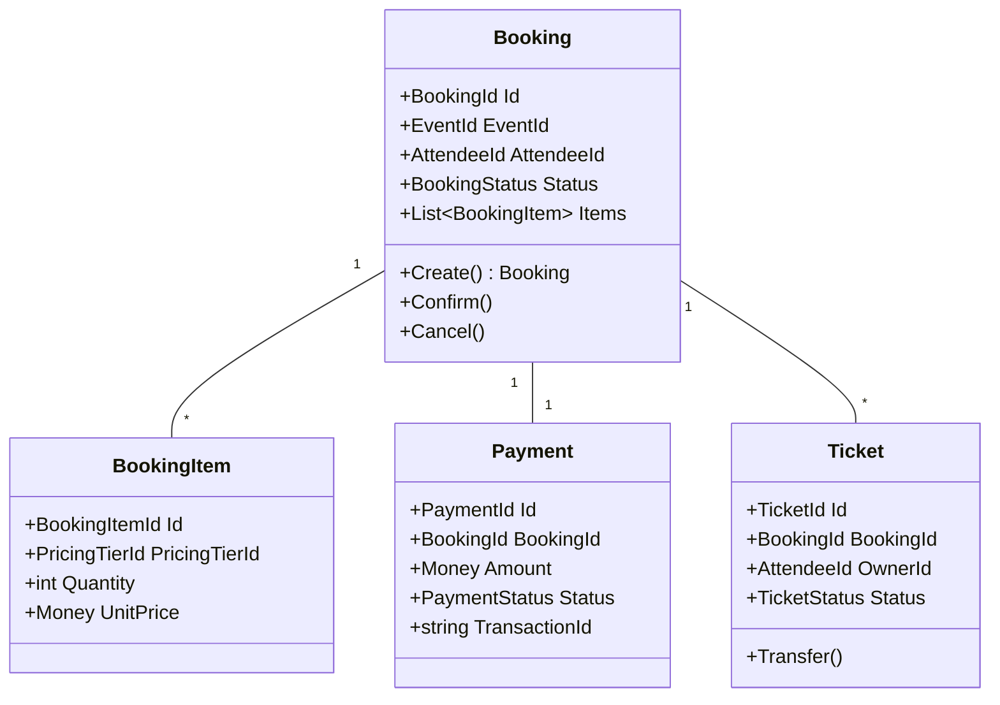

# Epic 2: Booking & Ticketing - Detailed Implementation Guide

## Table of Contents
1. [Epic Overview](#epic-overview)
2. [Domain Analysis](#domain-analysis)
3. [User Stories with Technical Details](#user-stories-with-technical-details)
4. [Domain Model Design](#domain-model-design)
5. [Technical Architecture](#technical-architecture)
6. [Implementation Roadmap](#implementation-roadmap)
7. [Testing Strategy](#testing-strategy)

## Epic Overview

**Epic 2: Booking & Ticketing**
```
As an attendee
I want to book tickets for events
So that I can secure my attendance
```

### Business Value
- **Primary Users**: Attendees
- **Business Goals**: Enable a seamless and secure booking experience for event attendees.
- **Success Metrics**: Booking conversion rate, time to complete booking, attendee satisfaction.

### Domain Complexity Assessment
**High Complexity** - This context requires full DDD implementation due to:
- Complex booking and payment workflows.
- Inventory management for tickets and pricing tiers.
- Business rules for cancellations, refunds, and ticket transfers.
- Integration with Payment Gateway and Notification contexts.

## Domain Analysis

### Bounded Context: Booking

#### Core Responsibilities
- Browsing and viewing available events.
- Managing the booking lifecycle (reservation -> payment -> confirmation).
- Handling ticket inventory and capacity constraints.
- Processing payments and managing refunds.
- Issuing and managing tickets.

#### Ubiquitous Language
- **Booking**: A reservation made by an attendee for one or more tickets to an event.
- **Attendee**: A user who books and attends an event.
- **Ticket**: A digital token representing the right to attend an event.
- **Reservation**: A temporary hold on a ticket while the booking is being completed.
- **Payment**: The financial transaction to purchase a ticket.
- **Booking Status**: The current state of a booking (e.g., Pending, Confirmed, Cancelled).

## User Stories with Technical Details

### US007: Browse Available Events

#### User Story
```
As an attendee
I want to browse available events
So that I can find events I'm interested in
```

#### Acceptance Criteria
```gherkin
Given I am a user on the platform
When I browse for events
Then I should see a list of all published and public events
And the list should be paginated
And I should be able to filter events by category, date, and location

Scenario: Browse events
Given there are 50 published public events
When I browse the events list
Then I should see the first 20 events
And I should be able to navigate to the next page to see more events
```

#### Technical Specifications

**API Endpoint**
```csharp
[ApiController]
[Route("api/v1/events")]
public class EventsController : ApiController
{
    [HttpGet]
    [AllowAnonymous]
    public async Task<IActionResult> GetPublishedEvents([FromQuery] int pageNumber = 1, [FromQuery] int pageSize = 20)
    {
        var query = new GetPublishedEventsQuery(pageNumber, pageSize);
        var result = await Mediator.Send(query);
        return Ok(result);
    }
}
```

**Query and Handler**
```csharp
public record GetPublishedEventsQuery(int PageNumber, int PageSize) : IRequest<PagedResult<EventSummaryViewModel>>;

public class GetPublishedEventsQueryHandler : IRequestHandler<GetPublishedEventsQuery, PagedResult<EventSummaryViewModel>>
{
    private readonly IEventRepository _eventRepository;
    private readonly IMapper _mapper;

    public async Task<PagedResult<EventSummaryViewModel>> Handle(GetPublishedEventsQuery request, CancellationToken cancellationToken)
    {
        var (events, totalCount) = await _eventRepository.GetPublishedEventsAsync(request.PageNumber, request.PageSize);
        var viewModels = _mapper.Map<IEnumerable<EventSummaryViewModel>>(events);
        return new PagedResult<EventSummaryViewModel>(viewModels, totalCount, request.PageNumber, request.PageSize);
    }
}
```

---

### US008: View Event Details and Availability

#### User Story
```
As an attendee
I want to view the details and availability of a specific event
So that I can make an informed decision before booking
```

#### Acceptance Criteria
```gherkin
Given I have the ID of a published event
When I view the event details
Then I should see the event's title, description, schedule, and venue
And I should see the available pricing tiers with their prices and remaining capacity

Scenario: View event details
Given a published event "event-123"
When I request the details for "event-123"
Then I should receive all public information about the event
And I should see that the "Early Bird" tier has "50 tickets left"
```

#### Technical Specifications

**API Endpoint**
```csharp
[ApiController]
[Route("api/v1/events")]
public class EventsController : ApiController
{
    [HttpGet("{id}")]
    [AllowAnonymous]
    public async Task<IActionResult> GetEvent(Guid id)
    {
        var query = new GetEventDetailsQuery(id);
        var result = await Mediator.Send(query);
        return result.IsSuccess ? Ok(result.Value) : NotFound();
    }
}
```

**Query and Handler**
```csharp
public record GetEventDetailsQuery(Guid EventId) : IRequest<Result<EventDetailsViewModel>>;

public class GetEventDetailsQueryHandler : IRequestHandler<GetEventDetailsQuery, Result<EventDetailsViewModel>>
{
    private readonly IEventRepository _eventRepository;
    private readonly IMapper _mapper;

    public async Task<Result<EventDetailsViewModel>> Handle(GetEventDetailsQuery request, CancellationToken cancellationToken)
    {
        var @event = await _eventRepository.GetByIdAsync(new EventId(request.EventId));
        if (@event == null || @event.Status != EventStatus.Published)
            return Result<EventDetailsViewModel>.Failure("Event not found or not published.");

        var viewModel = _mapper.Map<EventDetailsViewModel>(@event);
        return Result<EventDetailsViewModel>.Success(viewModel);
    }
}
```

---

### US009: Select Ticket Types and Quantities

#### User Story
```
As an attendee
I want to select ticket types and quantities for an event
So that I can begin the booking process
```

#### Acceptance Criteria
```gherkin
Given I am viewing a published event
When I select a quantity for one or more ticket tiers
And I initiate a booking
Then a booking reservation should be created with a pending status
And the selected ticket capacity should be temporarily held

Scenario: Create a booking reservation
Given event "event-123" has an "Early Bird" tier with 50 available tickets
When I select 2 "Early Bird" tickets and start the booking
Then a new booking record is created with status "Pending"
And the available capacity for the "Early Bird" tier is reduced by 2 for a limited time
```

#### Technical Specifications

**Domain Model: Booking Aggregate**
```csharp
public class Booking : AggregateRoot<BookingId>
{
    public EventId EventId { get; private set; }
    public AttendeeId AttendeeId { get; private set; }
    public BookingStatus Status { get; private set; }
    private readonly List<BookingItem> _items = new();
    public IReadOnlyList<BookingItem> Items => _items.AsReadOnly();
    public DateTime CreatedAt { get; private set; }
    public DateTime? ConfirmedAt { get; private set; }

    public static Booking Create(EventId eventId, AttendeeId attendeeId, IEnumerable<BookingItem> items)
    {
        var booking = new Booking
        {
            Id = BookingId.New(),
            EventId = eventId,
            AttendeeId = attendeeId,
            Status = BookingStatus.Pending,
            CreatedAt = DateTime.UtcNow
        };
        booking._items.AddRange(items);
        booking.AddDomainEvent(new BookingCreatedEvent(booking.Id, eventId, attendeeId));
        return booking;
    }
}

public class BookingItem : Entity<BookingItemId>
{
    public PricingTierId PricingTierId { get; private set; }
    public int Quantity { get; private set; }
    public Money UnitPrice { get; private set; }
}
```

**Command and Handler**
```csharp
public record CreateBookingCommand(Guid EventId, Guid AttendeeId, Dictionary<Guid, int> TicketQuantities) : ICommand<BookingId>;

public class CreateBookingCommandHandler : CommandHandler, IRequestHandler<CreateBookingCommand, Result<BookingId>>
{
    private readonly IEventRepository _eventRepository;
    private readonly IBookingRepository _bookingRepository;

    public async Task<Result<BookingId>> Handle(CreateBookingCommand command, CancellationToken cancellationToken)
    {
        var @event = await _eventRepository.GetByIdAsync(new EventId(command.EventId));
        if (@event == null || @event.Status != EventStatus.Published)
            return Result<BookingId>.Failure("Event is not available for booking.");

        var bookingItems = new List<BookingItem>();
        foreach (var (tierId, quantity) in command.TicketQuantities)
        {
            var tier = @event.PricingTiers.FirstOrDefault(t => t.Id.Value == tierId);
            if (tier == null || !tier.CanBookTickets(quantity))
                return Result<BookingId>.Failure($"Tickets for tier {tierId} are not available.");
            
            tier.ReserveCapacity(quantity); // This should be idempotent and handle race conditions
            bookingItems.Add(new BookingItem(tier.Id, quantity, tier.Price));
        }

        var booking = Booking.Create(new EventId(command.EventId), new AttendeeId(command.AttendeeId), bookingItems);
        await _bookingRepository.AddAsync(booking);
        await _eventRepository.UpdateAsync(@event); // To save capacity changes
        await _bookingRepository.UnitOfWork.SaveChangesAsync(cancellationToken);

        return Result<BookingId>.Success(booking.Id);
    }
}
```

---

### US010: Complete Payment Process

#### User Story
```
As an attendee
I want to complete the payment process for my booking
So that I can confirm my reservation
```

#### Acceptance Criteria
```gherkin
Given I have a pending booking
When I submit my payment details
And the payment is successfully processed by the payment gateway
Then my booking status should change to "Confirmed"
And tickets should be issued

Scenario: Successful payment
Given I have a pending booking "booking-456"
When I complete the payment successfully
Then the status of "booking-456" becomes "Confirmed"
And a `BookingConfirmedEvent` is raised
```

#### Technical Specifications

**Domain Model: Payment**
```csharp
public class Payment : AggregateRoot<PaymentId>
{
    public BookingId BookingId { get; private set; }
    public Money Amount { get; private set; }
    public PaymentStatus Status { get; private set; }
    public string TransactionId { get; private set; } // From payment gateway
    public DateTime CreatedAt { get; private set; }
    public DateTime? CompletedAt { get; private set; }
}
```

**Command and Handler**
```csharp
public record ProcessPaymentCommand(Guid BookingId, PaymentDetails PaymentDetails) : ICommand<Result>;

public class ProcessPaymentCommandHandler : CommandHandler, IRequestHandler<ProcessPaymentCommand, Result>
{
    private readonly IBookingRepository _bookingRepository;
    private readonly IPaymentGateway _paymentGateway;
    private readonly IPaymentRepository _paymentRepository;

    public async Task<Result> Handle(ProcessPaymentCommand command, CancellationToken cancellationToken)
    {
        var booking = await _bookingRepository.GetByIdAsync(new BookingId(command.BookingId));
        if (booking == null || booking.Status != BookingStatus.Pending)
            return Result.Failure("Booking not found or not pending.");

        var totalAmount = booking.Items.Sum(item => item.UnitPrice.Amount * item.Quantity);
        var paymentResult = await _paymentGateway.ProcessPayment(totalAmount, command.PaymentDetails);

        if (paymentResult.IsSuccess)
        {
            booking.Confirm();
            var payment = Payment.Create(booking.Id, new Money(totalAmount, "USD"), paymentResult.TransactionId);
            await _paymentRepository.AddAsync(payment);
            await _bookingRepository.UpdateAsync(booking);
            await _paymentRepository.UnitOfWork.SaveChangesAsync(cancellationToken);
            return Result.Success();
        }
        else
        {
            return Result.Failure("Payment failed.");
        }
    }
}
```

---

### US011: Receive Booking Confirmation

#### User Story
```
As an attendee
I want to receive a booking confirmation
So that I have proof of my booking and my tickets
```

#### Acceptance Criteria
```gherkin
Given my booking is confirmed
Then I should receive a confirmation email
And the email should contain my booking details and tickets (e.g., as a PDF or QR code)

Scenario: Confirmation email
Given booking "booking-456" is confirmed
Then an email is sent to my registered address
And the email includes a summary of my order and attached tickets
```

#### Technical Specifications

**Event Handler**
```csharp
public class BookingConfirmedEventHandler : INotificationHandler<BookingConfirmedEvent>
{
    private readonly INotificationService _notificationService;
    private readonly ITicketGenerator _ticketGenerator;
    private readonly IUserRepository _userRepository;

    public async Task Handle(BookingConfirmedEvent notification, CancellationToken cancellationToken)
    {
        var user = await _userRepository.GetByIdAsync(notification.AttendeeId);
        var tickets = await _ticketGenerator.GenerateTicketsForBooking(notification.BookingId);
        
        await _notificationService.SendBookingConfirmationEmailAsync(user.Email, notification.BookingId, tickets);
    }
}
```

---

### US012: Cancel/Modify Bookings

#### User Story
```
As an attendee
I want to cancel or modify my booking (if the event policy allows)
So that I can manage my attendance plans
```

#### Acceptance Criteria
```gherkin
Given I have a confirmed booking for an event that allows cancellations
When I cancel my booking
Then my booking status should change to "Cancelled"
And a refund should be processed according to the event's refund policy
And the ticket capacity should be released

Scenario: Cancel a booking
Given I have a confirmed booking "booking-456"
And the event policy allows cancellations with a full refund up to 7 days before the event
When I cancel my booking 10 days before the event
Then the status of "booking-456" becomes "Cancelled"
And a full refund is initiated
And the booked tickets are returned to the available capacity
```

#### Technical Specifications

**Domain Model: Booking**
```csharp
public partial class Booking : AggregateRoot<BookingId>
{
    public void Cancel(IEventCancellationPolicy policy)
    {
        if (!policy.CanCancel(this))
            throw new DomainException("Booking cannot be cancelled at this time.");

        Status = BookingStatus.Cancelled;
        AddDomainEvent(new BookingCancelledEvent(Id, EventId, Items));
    }
}
```

**Command and Handler**
```csharp
public record CancelBookingCommand(Guid BookingId, Guid AttendeeId) : ICommand<Result>;

public class CancelBookingCommandHandler : CommandHandler, IRequestHandler<CancelBookingCommand, Result>
{
    private readonly IBookingRepository _bookingRepository;
    private readonly IEventRepository _eventRepository;

    public async Task<Result> Handle(CancelBookingCommand command, CancellationToken cancellationToken)
    {
        var booking = await _bookingRepository.GetByIdAsync(new BookingId(command.BookingId));
        if (booking == null || booking.AttendeeId.Value != command.AttendeeId)
            return Result.Failure("Booking not found.");

        var @event = await _eventRepository.GetByIdAsync(booking.EventId);
        var policy = @event.GetCancellationPolicy(); // Assumes event has a cancellation policy

        try
        {
            booking.Cancel(policy);
            await _bookingRepository.UpdateAsync(booking);
            await _bookingRepository.UnitOfWork.SaveChangesAsync(cancellationToken);
            return Result.Success();
        }
        catch (DomainException ex)
        {
            return Result.Failure(ex.Message);
        }
    }
}
```

---

### US013: Transfer Tickets to Other Users

#### User Story
```
As an attendee
I want to transfer my ticket to another user
So that someone else can attend in my place if I cannot
```

#### Acceptance Criteria
```gherkin
Given I have a confirmed ticket for an event
When I transfer my ticket to another registered user
Then the ticket ownership should be transferred to the new user
And the original ticket should be invalidated
And the new user should receive the ticket

Scenario: Transfer a ticket
Given I own ticket "ticket-789"
When I transfer it to user "user-abc"
Then "ticket-789" is marked as transferred
And a new ticket "ticket-987" is issued to "user-abc"
And "user-abc" receives a notification with their new ticket
```

#### Technical Specifications

**Domain Model: Ticket**
```csharp
public class Ticket : AggregateRoot<TicketId>
{
    public BookingId BookingId { get; private set; }
    public AttendeeId OwnerId { get; private set; }
    public TicketStatus Status { get; private set; }

    public void Transfer(AttendeeId newOwnerId)
    {
        if (Status != TicketStatus.Active)
            throw new DomainException("Only active tickets can be transferred.");

        Status = TicketStatus.Transferred;
        AddDomainEvent(new TicketTransferredEvent(Id, OwnerId, newOwnerId));
    }
}
```

**Command and Handler**
```csharp
public record TransferTicketCommand(Guid TicketId, Guid CurrentOwnerId, Guid NewOwnerId) : ICommand<Result>;

public class TransferTicketCommandHandler : CommandHandler, IRequestHandler<TransferTicketCommand, Result>
{
    private readonly ITicketRepository _ticketRepository;

    public async Task<Result> Handle(TransferTicketCommand command, CancellationToken cancellationToken)
    {
        var ticket = await _ticketRepository.GetByIdAsync(new TicketId(command.TicketId));
        if (ticket == null || ticket.OwnerId.Value != command.CurrentOwnerId)
            return Result.Failure("Ticket not found or you are not the owner.");

        ticket.Transfer(new AttendeeId(command.NewOwnerId));
        await _ticketRepository.UpdateAsync(ticket);
        await _ticketRepository.UnitOfWork.SaveChangesAsync(cancellationToken);
        return Result.Success();
    }
}
```

## Domain Model Design

### Booking Aggregate Diagram



## Technical Architecture

### Application Layer Structure for Booking

```
Src/DDD.Application/Services/Booking/
├── BookingAppService.cs
├── Commands/
│   ├── CreateBookingCommand.cs
│   ├── ProcessPaymentCommand.cs
│   ├── CancelBookingCommand.cs
│   └── TransferTicketCommand.cs
├── CommandHandlers/
│   ├── CreateBookingCommandHandler.cs
│   ├── ProcessPaymentCommandHandler.cs
│   ├── CancelBookingCommandHandler.cs
│   └── TransferTicketCommandHandler.cs
├── EventHandlers/
│   ├── BookingConfirmedEventHandler.cs
│   ├── BookingCancelledEventHandler.cs
│   └── TicketTransferredEventHandler.cs
├── Queries/
│   ├── GetBookingQuery.cs
│   └── GetUserBookingsQuery.cs
└── ViewModels/
    ├── BookingViewModel.cs
    └── TicketViewModel.cs
```

## Implementation Roadmap

### Phase 1: Event Discovery (Week 3)
- **US007**: Browse Available Events
- **US008**: View Event Details and Availability

### Phase 2: Core Booking Flow (Week 4)
- **US009**: Select Ticket Types and Quantities
- **US010**: Complete Payment Process
- **US011**: Receive Booking Confirmation

### Phase 3: Booking Management (Week 5)
- **US012**: Cancel/Modify Bookings
- **US013**: Transfer Tickets to Other Users

## Testing Strategy

### Unit Tests
- Test the `Booking` aggregate's state transitions and business rules.
- Test the `Payment` and `Ticket` domain models.
- Test command handlers for validation and correct domain model interaction.

### Integration Tests
- Test the full booking flow from creating a reservation to confirming payment.
- Test the interaction with the payment gateway (using a mock).
- Test that event capacity is correctly updated after a booking.

### Domain Event Testing
- Test that `BookingConfirmedEvent` triggers the notification handler.
- Test that `BookingCancelledEvent` triggers refund and capacity release logic.
