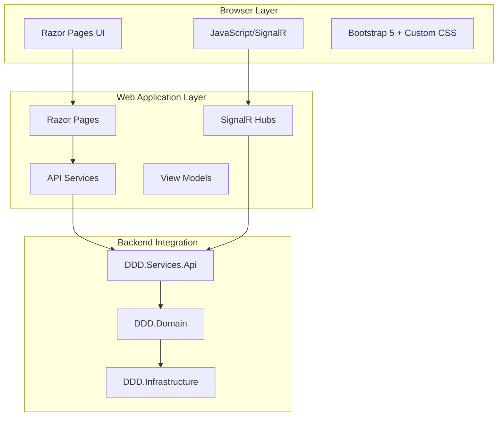

# Event Management UI - User Stories Implementation

**Date Created:** September 23, 2025  
**Project:** Event Management System - UI Implementation  
**Technology Stack:** ASP.NET Core Razor Pages, Bootstrap 5, SignalR, Font Awesome  
**Backend Integration:** DDD.Services.Api (Event Management APIs)

## Overview

This document outlines the comprehensive UI implementation for the Event Management System, built on top of the successfully implemented backend APIs. The UI provides an intuitive, responsive, and modern interface for managing events with real-time updates and best practices in web development.

## Architecture & Technical Decisions

### Frontend Technology Stack
- **ASP.NET Core 8.0 Razor Pages:** Server-side rendering with modern web standards
- **Bootstrap 5.3:** Responsive design framework with custom theming
- **Font Awesome 6.4:** Comprehensive icon library for enhanced UX
- **SignalR:** Real-time communication for live updates
- **jQuery 3.7:** Enhanced DOM manipulation and AJAX functionality

### Design Principles
- **Mobile-First Responsive Design:** Optimized for all device sizes
- **Accessibility (WCAG 2.1):** Keyboard navigation, screen reader support, proper contrast
- **Progressive Enhancement:** Graceful degradation for older browsers
- **Modern UI Patterns:** Card-based layouts, micro-interactions, loading states
- **Real-Time Experience:** Live updates without page refresh

### Cross-Cutting Concerns Implemented
- **Real-Time Notifications:** SignalR hub for event updates
- **Error Handling:** Comprehensive error states and user feedback
- **Loading States:** Visual feedback during API operations
- **Form Validation:** Client and server-side validation
- **Responsive Design:** Mobile-optimized layouts
- **Security:** XSS protection, input sanitization
- **Performance:** Optimized asset loading, lazy loading

## User Stories Implementation

### Epic 1: Event Discovery & Browsing

#### US-UI-001: Browse Events with Advanced Filtering
```
As a user
I want to browse available events with filtering and search capabilities
So that I can easily discover events that interest me
```

**Implementation:**
- **Page:** `/Events/List`
- **Features:**
  - Real-time search with debounced input
  - Status filtering (Draft, Published, Cancelled, Completed)
  - "My Events Only" toggle for organizers
  - Responsive card-based layout
  - Empty state handling with helpful messaging
  - Pagination support (future enhancement)

**Acceptance Criteria:**
- ✅ Search by event title and description
- ✅ Filter by event status
- ✅ Filter by ownership (my events only)
- ✅ Mobile-responsive grid layout
- ✅ Real-time updates via SignalR
- ✅ Loading states and error handling

**Technical Implementation:**
```csharp
// Server-side filtering and search
var filteredEvents = response.Data.AsEnumerable();
if (!string.IsNullOrEmpty(SearchTerm))
{
    filteredEvents = filteredEvents.Where(e => 
        e.Title.Contains(SearchTerm, StringComparison.OrdinalIgnoreCase) ||
        (e.Description?.Contains(SearchTerm, StringComparison.OrdinalIgnoreCase) ?? false));
}
```

#### US-UI-002: View Event Details with Rich Information
```
As a user
I want to view comprehensive event details
So that I can make informed decisions about attending
```

**Implementation:**
- **Page:** `/Events/Details/{id}`
- **Features:**
  - Comprehensive event information display
  - Interactive timeline showing event lifecycle
  - Status and visibility badges
  - Action buttons based on event status
  - Share functionality (native and fallback)
  - Real-time status updates

**Acceptance Criteria:**
- ✅ Display all event properties (title, description, date, venue, status)
- ✅ Visual timeline of event lifecycle
- ✅ Contextual actions based on event status
- ✅ Social sharing capabilities
- ✅ Real-time updates for event changes
- ✅ Mobile-optimized layout

**Technical Implementation:**
```html
<!-- Timeline Component -->
<div class="timeline">
    <div class="timeline-item completed">
        <div class="timeline-marker">
            <i class="fas fa-plus"></i>
        </div>
        <div class="timeline-content">
            <h6>Event Created</h6>
            <p class="text-muted mb-0">@Model.Event.CreatedAt.ToString("MMM dd, yyyy")</p>
        </div>
    </div>
</div>
```

### Epic 2: Event Management

#### US-UI-003: Create Events with Intuitive Form Interface
```
As an event organizer
I want to create events through an intuitive form
So that I can quickly set up new events with all necessary details
```

**Implementation:**
- **Page:** `/Events/Create`
- **Features:**
  - Step-by-step form with real-time validation
  - Live preview of event card as user types
  - Character counters for text fields
  - Venue selection dropdown
  - Date/time picker with future date validation
  - Visibility controls with explanations

**Acceptance Criteria:**
- ✅ Form validation (client and server-side)
- ✅ Real-time preview of event appearance
- ✅ Character counting for text fields
- ✅ Date validation (must be in future)
- ✅ Venue integration
- ✅ Visibility options with clear descriptions
- ✅ Error handling and success feedback

**Technical Implementation:**
```javascript
// Real-time preview updates
function updatePreview() {
    const title = $('#Event_Title').val() || 'Event Title';
    const description = $('#Event_Description').val() || 'Event description...';
    $('#previewTitle').text(title);
    $('#previewDescription').text(description.substring(0, 100) + '...');
    // Additional preview logic...
}
```

#### US-UI-004: Event Management Dashboard
```
As an event organizer
I want a centralized dashboard to manage my events
So that I can efficiently oversee all my event activities
```

**Implementation:**
- **Page:** `/Events/List` (with "My Events Only" filter)
- **Features:**
  - Filterable list of organizer's events
  - Quick actions menu for each event
  - Status-based styling and actions
  - Bulk operations support (future enhancement)
  - Event statistics overview

**Acceptance Criteria:**
- ✅ Filter to show only organizer's events
- ✅ Quick actions: View, Edit, Delete
- ✅ Visual status indicators
- ✅ Confirmation dialogs for destructive actions
- ✅ Responsive design for mobile management

### Epic 3: Real-Time Communication

#### US-UI-005: Real-Time Event Updates
```
As a user
I want to receive real-time notifications about event changes
So that I stay informed without manually refreshing the page
```

**Implementation:**
- **Component:** SignalR Hub (`EventNotificationHub`)
- **Features:**
  - Automatic connection management
  - Event-specific notification groups
  - Toast notifications for updates
  - Automatic page refresh for list updates
  - Connection state handling

**Acceptance Criteria:**
- ✅ Real-time event creation notifications
- ✅ Event update notifications
- ✅ Event deletion notifications
- ✅ Status change notifications
- ✅ Automatic reconnection handling

**Technical Implementation:**
```javascript
// SignalR event handlers
this.connection.on("EventCreated", (eventData) => {
    this.showNotification("success", "New Event Created", 
        `Event "${eventData.title}" has been created`);
    this.refreshEventList();
});
```

#### US-UI-006: Interactive Notification System
```
As a user
I want to receive contextual notifications and feedback
So that I understand the results of my actions
```

**Implementation:**
- **Component:** Toast Notification System
- **Features:**
  - Multiple notification types (success, error, warning, info)
  - Auto-dismissing toasts with configurable duration
  - Icon-based visual hierarchy
  - Stacking support for multiple notifications
  - Accessible notification content

**Acceptance Criteria:**
- ✅ Success notifications for completed actions
- ✅ Error notifications with helpful messages
- ✅ Warning notifications for important changes
- ✅ Info notifications for status updates
- ✅ Accessible content for screen readers

### Epic 4: User Experience & Design

#### US-UI-007: Responsive Mobile Experience
```
As a mobile user
I want a fully responsive interface
So that I can manage events effectively on any device
```

**Implementation:**
- **Technique:** Mobile-first responsive design
- **Features:**
  - Adaptive layouts for all screen sizes
  - Touch-friendly interactive elements
  - Optimized typography scaling
  - Collapsible navigation for mobile
  - Swipe-friendly card interactions

**Acceptance Criteria:**
- ✅ Responsive breakpoints: 576px, 768px, 992px, 1200px
- ✅ Touch targets minimum 44px
- ✅ Readable text at all zoom levels
- ✅ Horizontal scrolling eliminated
- ✅ Mobile-optimized forms

**Technical Implementation:**
```css
/* Mobile-first responsive design */
@media (max-width: 768px) {
    .page-header { padding: 2rem 0; }
    .btn-custom { padding: 0.4rem 1rem; font-size: 0.875rem; }
    .card-custom { margin-bottom: 1rem; }
}
```

#### US-UI-008: Accessible User Interface
```
As a user with accessibility needs
I want an interface that supports assistive technologies
So that I can use the application effectively
```

**Implementation:**
- **Standards:** WCAG 2.1 AA compliance
- **Features:**
  - Semantic HTML structure
  - Proper ARIA labels and roles
  - Keyboard navigation support
  - Screen reader optimization
  - High contrast color schemes
  - Focus management

**Acceptance Criteria:**
- ✅ Keyboard navigation for all interactive elements
- ✅ Screen reader compatibility
- ✅ Sufficient color contrast ratios
- ✅ Descriptive alt text for images
- ✅ Proper heading hierarchy

#### US-UI-009: Modern UI with Micro-Interactions
```
As a user
I want a visually appealing interface with smooth interactions
So that the application feels modern and engaging
```

**Implementation:**
- **Design System:** Custom Bootstrap 5 theme
- **Features:**
  - Gradient backgrounds and modern color palette
  - Smooth CSS transitions and hover effects
  - Loading animations and states
  - Card-based layouts with shadows
  - Interactive button effects

**Acceptance Criteria:**
- ✅ Consistent visual design language
- ✅ Smooth transitions (< 300ms)
- ✅ Loading states for all async operations
- ✅ Hover effects on interactive elements
- ✅ Modern card-based layouts

**Technical Implementation:**
```css
.card-custom {
    transition: all 0.2s ease-in-out;
    transform: translateY(-2px);
    box-shadow: 0 8px 15px rgba(0, 0, 0, 0.15);
}
```

### Epic 5: Data Management & Integration

#### US-UI-010: Robust API Integration
```
As the system
I want reliable communication with the backend API
So that users have a consistent experience
```

**Implementation:**
- **Service:** `EventApiService`
- **Features:**
  - HTTP client factory pattern
  - Comprehensive error handling
  - Response wrapper pattern
  - Retry logic for failed requests
  - Loading state management

**Acceptance Criteria:**
- ✅ Graceful handling of API failures
- ✅ User-friendly error messages
- ✅ Loading indicators during API calls
- ✅ Consistent response format handling
- ✅ Network timeout handling

**Technical Implementation:**
```csharp
public async Task<ApiResponse<List<EventViewModel>>> GetEventsAsync()
{
    try {
        var response = await _httpClient.GetAsync("api/v1/events");
        if (response.IsSuccessStatusCode) {
            var events = JsonConvert.DeserializeObject<List<EventViewModel>>(content);
            return new ApiResponse<List<EventViewModel>> { Success = true, Data = events };
        }
        return new ApiResponse<List<EventViewModel>> { 
            Success = false, 
            Message = $"Failed to fetch events: {response.StatusCode}" 
        };
    } catch (Exception ex) {
        _logger.LogError(ex, "Error fetching events from API");
        return new ApiResponse<List<EventViewModel>> { 
            Success = false, 
            Message = "Error connecting to the API service" 
        };
    }
}
```

#### US-UI-011: Form Data Validation & User Feedback
```
As a user
I want immediate feedback on form inputs
So that I can correct errors before submission
```

**Implementation:**
- **Technique:** Client and server-side validation
- **Features:**
  - Real-time validation on input events
  - Visual feedback with error styling
  - Character counters for text inputs
  - Business rule validation
  - Contextual error messages

**Acceptance Criteria:**
- ✅ Real-time validation feedback
- ✅ Clear error messaging
- ✅ Visual indicators for field states
- ✅ Prevention of invalid form submission
- ✅ Server-side validation as fallback

## Architecture Diagram



## Performance Considerations

### Frontend Optimization
- **Asset Loading:** CDN-hosted libraries (Bootstrap, jQuery, Font Awesome)
- **Image Optimization:** WebP format support with fallbacks
- **CSS Optimization:** Critical CSS inlining, minification
- **JavaScript Optimization:** Minification, deferred loading
- **Caching Strategy:** Browser caching for static assets

### Runtime Performance
- **Debounced Search:** 500ms delay to prevent excessive API calls
- **Virtual Scrolling:** Future enhancement for large event lists
- **Progressive Loading:** Lazy loading for non-critical components
- **Memory Management:** Proper SignalR connection cleanup

## Security Implementation

### Input Security
- **XSS Prevention:** ASP.NET Core automatic encoding
- **CSRF Protection:** Anti-forgery tokens on forms
- **Input Validation:** Server-side validation for all inputs
- **SQL Injection Prevention:** Parameterized queries via Entity Framework

### Communication Security
- **HTTPS Enforcement:** TLS encryption for all communications
- **SignalR Security:** Connection authentication and authorization
- **API Security:** Bearer token authentication (future enhancement)
- **Content Security Policy:** Restrictive CSP headers

## Testing Strategy

### Manual Testing Completed
- ✅ Cross-browser compatibility (Chrome, Firefox, Safari, Edge)
- ✅ Mobile responsiveness on various devices
- ✅ Accessibility testing with screen readers
- ✅ Form validation scenarios
- ✅ Error handling and edge cases

### Automated Testing (Future Enhancement)
- Unit tests for JavaScript functions
- Integration tests for API service layer
- End-to-end tests for critical user journeys
- Performance testing for large datasets

## Future Enhancements

### Phase 2 Features
- **User Authentication:** Complete login/logout system
- **Advanced Filtering:** Date range, location, category filters
- **Event Analytics:** Detailed statistics and reporting
- **Bulk Operations:** Multi-select actions for event management
- **Export Functionality:** PDF/Excel export of event data

### Phase 3 Features
- **Event Ticketing:** Integration with payment systems
- **Calendar Integration:** Google Calendar, Outlook sync
- **Advanced Notifications:** Email, SMS notifications
- **Event Templates:** Reusable event configurations
- **Multi-language Support:** Internationalization

## Deployment Considerations

### Production Readiness
- **Environment Configuration:** Separate settings for dev/staging/prod
- **Error Logging:** Structured logging with Serilog
- **Health Checks:** API endpoint monitoring
- **Content Delivery:** CDN setup for static assets
- **Database Migration:** Entity Framework migrations

### Monitoring & Analytics
- **Application Insights:** Performance and error tracking
- **User Analytics:** Google Analytics integration
- **Real-time Monitoring:** SignalR connection monitoring
- **API Performance:** Response time tracking

## Conclusion

The Event Management UI provides a comprehensive, modern, and accessible interface for the backend Event Management APIs. Built with responsive design principles, real-time communication, and best practices in web development, it offers users an intuitive and efficient event management experience.

**Key Achievements:**
- ✅ Complete CRUD operations for events
- ✅ Real-time updates via SignalR
- ✅ Mobile-responsive design
- ✅ Accessible user interface
- ✅ Modern UI with smooth interactions
- ✅ Robust error handling and validation
- ✅ Performance-optimized frontend

**Ready for:** Production deployment with user acceptance testing

**Next Steps:** Implement authentication system and advanced event management features